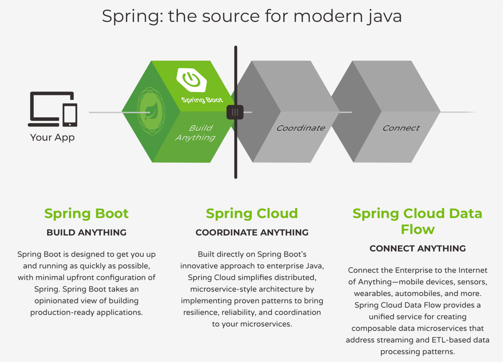

# 从 Spring 到 Spring Boot

[TOC]

## 重新认识 Spring Boot

### 认识 Spring Boot 的组成部分

### Spring Boot 不是什么 

- 不是 Java EE 之类的规范 
- 不是代码⽣成器 
- 不是 Spring Framework 的升级版 
- 不是应⽤服务器 

### Spring Boot 的特性 

- ⽅便地创建可独⽴运⾏的 Spring 应⽤程序 
- 直接内嵌 Tomcat、Jetty 或 Undertow 
- 简化了项⽬的构建配置 
- 为 Spring 及第三⽅库提供⾃动配置 
- 提供⽣产级特性 
- ⽆需⽣成代码或进⾏ XML 配置 

### Spring Boot 的四⼤核⼼ 

- ⾃动配置 - Auto Configuration 
- 起步依赖 - Starter Dependency 
- 命令⾏界⾯ - Spring Boot CLI 
- Actuator 

## 了解⾃动配置的实现原理 

### 了解⾃动配置 

- ⾃动配置 
  - 基于添加的 JAR 依赖⾃动对 Spring Boot 应⽤程序进⾏配置 
  - spring-boot-autoconfiguration 

- 开启⾃动配置
  - @EnableAutoConfiguration 
    - exclude = Class<?>[] 
  - @SpringBootApplication 

### ⾃动配置的实现原理 

- @EnableAutoConfiguration
  - AutoConfigurationImportSelector 
  - META-INF/spring.factories 
    - org.springframework.boot.autoconfigure.EnableAutoConfiguration 

- 条件注解 
  - @Conditional 
  - @ConditionalOnClass 
  - @ConditionalOnBean 
  - @ConditionalOnMissingBean 
  - @ConditionalOnProperty 
  - …… 

- 观察⾃动配置的判断结果 
  -  --debug 
- ConditionEvaluationReportLoggingListener
  - Positive matches 
  - Negative matches 
  - Exclusions 
  - Unconditional classes 

3. ## 动⼿实现⾃⼰的⾃动配置 

### 主要⼯作内容 

1. 编写 Java Config 
   - @Configuration 
2. 添加条件 
   - @Conditional 
3. 定位⾃动配置
   - META-INF/spring.factories 

### 条件注解⼤家庭 

- 条件注解 
  - @Conditional 
- 类条件
  - @ConditionalOnClass 
  - @ConditionalOnMissingClass 
- 属性条件
  - @ConditionalOnProperty 

- Bean 条件 
  - @ConditionalOnBean 
  - @ConditionalOnMissingBean 
  - @ConditionalOnSingleCandidate 
- 资源条件
  - @ConditionalOnResource 

- Web 应⽤条件 
  - @ConditionalOnWebApplication 
  - @ConditionalOnNotWebApplication 
- 其他条件
  - @ConditionalOnExpression 
  - @ConditionalOnJava 
  - @ConditionalOnJndi 

- ⾃动配置的执⾏顺序 
  - 执⾏顺序 
    - @AutoConfigureBefore 
    - @AutoConfigureAfter 
    - @AutoConfigureOrder 

------

------

### 如何在低版本 Spring 中快速实现类似⾃动配置的功能 

#### 需求与问题 

- 核⼼的诉求 
  - 现存系统，不打算重构 
  - Spring 版本3.x，不打算升级版本和引⼊ Spring Boot 
  - 期望能够在少改代码的前提下实现⼀些功能增强 
- ⾯临的问题
  - 3.x 的 Spring 没有条件注解 
  - ⽆法⾃动定位需要加载的⾃动配置 

#### 核⼼解决思路 

- 条件判断 
  - 通过  BeanFactoryPostProcessor进⾏判断 
- 配置加载 
  - 编写 Java Config 类 
  - 引⼊配置类 
  - 通过  component-scan 
  - 通过 XML ⽂件  import 

#### Spring 的两个扩展点 

- BeanPostProcessor 
  - 针对 Bean 实例 
  - 在 Bean 创建后提供定制逻辑回调 
- BeanFactoryPostProcessor 
  - 针对 Bean 定义 
  - 在容器创建 Bean 前获取配置元数据 
  - Java Config 中需要定义为static⽅法 

#### 关于 Bean 的⼀些定制 

- Lifecycle Callback 
  - InitializingBean / @PostConstruct / init-method 
  - DisposableBean / @PreDestroy / destroy-method 
- XxxAware 接⼝
  - ApplicationContextAware 
  - BeanFactoryAware 
  - BeanNameAware 

#### ⼀些常⽤操作 

- 判断类是否存在 
  - ClassUtils.isPresent() 
- 判断 Bean 是否已定义
  - ListableBeanFactory.containsBeanDefinition() 
  - ListableBeanFactory.getBeanNamesForType() 
- 注册 Bean 定义 
  - BeanDefinitionRegistry.registerBeanDefinition() 
    - GenericBeanDefinition 
  - BeanFactory.registerSingleton() 

------

------

## 了解起步依赖及其实现原理 

> 很久以前…… 
>
> 你能记得多少 Maven 依赖 
>
> 要实现⼀个功能，需要引⼊哪些依赖 
>
> 多个依赖项⽬之间是否会有兼容问题 
> …… 

### 关于 Maven 依赖管理的⼀些⼩技巧 

- 了解你的依赖 
  - mvn dependency:tree 
  - IDEA Maven Helper 插件 
- 排除特定依赖
  - exclusion 
- 统⼀管理依赖
  - dependencyManagement 
  - Bill of Materials - bom 

### Spring Boot 的起步依赖 

- Starter Dependencies 
  - 直接⾯向功能 
  - ⼀站获得所有相关依赖，不再复制粘贴 
- 官⽅的 Starters
  - spring-boot-starter-* 

### 定制⾃⼰的起步依赖 

#### 你的 Starter 

- 主要内容 
  - autoconfigure 模块，包含⾃动配置代码 
  - starter 模块，包含指向⾃动配置模块的依赖及其他相关依赖 
- 命名⽅式 
  - xxx-spring-boot-autoconfigure 
  - xxx-spring-boot-starter 

- ⼀些注意事项 
  - 不要使⽤ spring-boot 作为依赖的前缀 
  - 不要使⽤ spring-boot 的配置命名空间 
  - starter 中仅添加必要的依赖 
  - 声明对 spring-boot-starter 的依赖 

------

------

## 深挖 Spring Boot 的配置加载机制 

### 外化配置加载顺序 

- 开启 DevTools 时，~/.spring-boot-devtools.properties 
- 测试类上的  @TestPropertySource注解 
- @SpringBootTest#properties属性 
- 命令⾏参数（ --server.port=9000 ） 
- SPRING_APPLICATION_JSON中的属性 
- 开启 DevTools 时，~/.spring-boot-devtools.properties 
- 测试类上的  @TestPropertySource注解 
- @SpringBootTest#properties属性 
- 命令⾏参数（ --server.port=9000 ） 
- SPRING_APPLICATION_JSON中的属性 

- jar 包外部的 application-{profile}.properties 或 .yml 
- jar 包内部的 application-{profile}.properties 或 .yml 
- jar 包外部的 application.properties 或 .yml 
- jar 包内部的 application.properties 或 .yml 

- @Configuration类上的  @PropertySource 
- SpringApplication.setDefaultProperties()设置的默认属性 

### application.properties 

- 默认位置 
  - ./config 
  - ./ 
  - CLASSPATH 中的  /config 
  -  CLASSPATH 中的  / 

- 修改名字或路径 
  - spring.config.name 
  - spring.config.location 
  - spring.config.additional-location 

- Relaxed Binding 

  |      命名⻛格      |              使⽤范围              |              示例              |
  | :----------------: | :--------------------------------: | :----------------------------: |
  |     短划线分隔     |                                    | geektime.spring-boot.first-demo |
  |       驼峰式       | Properties ⽂件 YAML ⽂件 系统属性 |  geektime.springBoot.firstDemo  |
  |     下划线分隔     |                                    | geektime.spring_boot.first_demo |
  | 全⼤写，下划线分隔 |              环境变量              | GEEKTIME_SPRINGBOOT_FIRSTDEMO  |

## 理解配置背后的 PropertySource 抽象 

### PropertySource 

- 添加 PropertySource 
  - <context:property-placeholder> 
  - PropertySourcesPlaceholderConfigurer 
    - PropertyPlaceholderConfigurer 
  - @PropertySource 
  - @PropertySources 

### Spring Boot 中的 @ConfigurationProperties 

- 可以将属性绑定到结构化对象上 
- ⽀持 Relaxed Binding 
- ⽀持安全的类型转换 
- @EnableConfigurationProperties 

### 定制 PropertySource 

- 主要步骤 
  - 实现  PropertySource<T> 
  - 从  Environment取得  PropertySources 
  - 将⾃⼰的  PropertySource添加到合适的位置 
- 切⼊位置
  - EnvironmentPostProcessor 
  - BeanFactoryPostProcessor 

------

------

