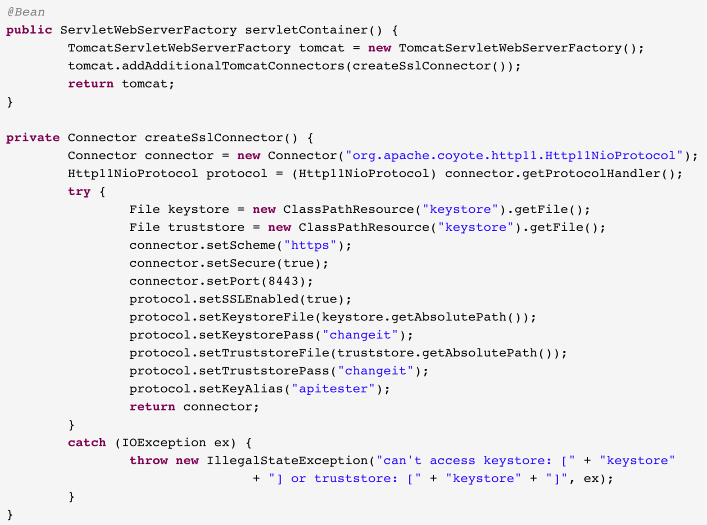
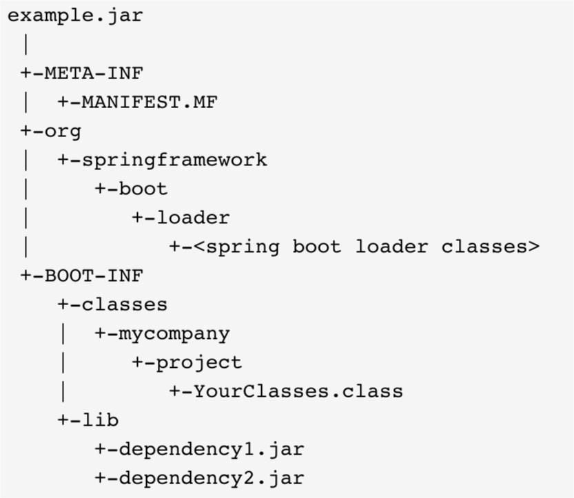
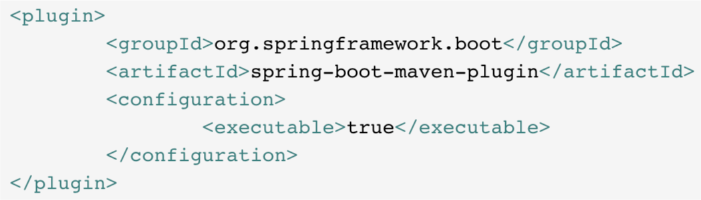
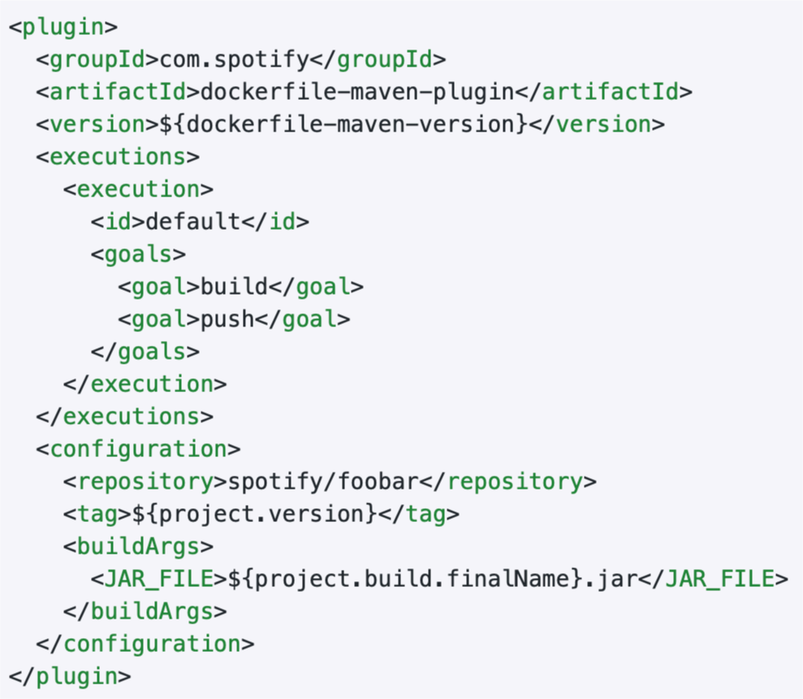

# 运⾏中的 Spring Boot 

[TOC]

## 认识 Spring Boot 的各类 Actuator Endpoint

### Actuator 

- ⽬的 
  - 监控并管理应⽤程序 
- 访问⽅式
  - HTTP 
  - JMX 
- 依赖
  - spring-boot-starter-actuator 

### ⼀些常⽤ Endpoint 

|       ID       |                 说明                  | 默认开启 | 默认 HTTP | 默认 JMX |
| :------------: | :-----------------------------------: | :------: | :-------: | :------: |
|     beans      |        显示容器中的 Bean 列表         |    Y     |     N     |    Y     |
|     caches     |           显示应⽤中的缓存            |    Y     |     N     |    Y     |
|   conditions   |        显示配置条件的计算情况         |    Y     |     N     |    Y     |
|  configprops   | 显示  @ConfigurationProperties的信息  |    Y     |     N     |    Y     |
|      env       | 显示  ConfigurableEnvironment中的属性 |    Y     |     N     |    Y     |
|     health     |           显示健康检查信息            |    Y     |     Y     |    Y     |
|   httptrace    |         显示 HTTP Trace 信息          |    Y     |     N     |    Y     |
|      info      |         显示设置好的应⽤信息          |    Y     |     Y     |    Y     |
|    loggers     |          显示并更新⽇志配置           |    Y     |     N     |    Y     |
|    metrics     |          显示应⽤的度量信息           |    Y     |     N     |    Y     |
|    mappings    |    显示所有的  @RequestMapping信息    |    Y     |     N     |    Y     |
| scheduledtasks |        显示应⽤的调度任务信息         |    Y     |     N     |    Y     |
|    shutdown    |          优雅地关闭应⽤程序           |    N     |     N     |    Y     |
|   threaddump   |           执⾏ Thread Dump            |    Y     |     N     |    Y     |
|    heapdump    |   返回 Heap Dump ⽂件，格式为 HPROF   |    Y     |     N     |   N/A    |
|   prometheus   |    返回可供 Prometheus 抓取的信息     |    Y     |     N     |   N/A    |

### 如何访问 Actuator Endpoint 

- HTTP 访问 
  - /actuator/<id> 
- 端⼝与路径 
  - management.server.address= 
  - management.server.port= 
  - management.endpoints.web.base-path=/actuator 
  - management.endpoints.web.path-mapping.<id>=路径 

- 开启 Endpoint 
  - management.endpoint.<id>.enabled=true 
  - management.endpoints.enabled-by-default=false 
- 暴露 Endpoint
  - management.endpoints.jmx.exposure.exclude= 
  - management.endpoints.jmx.exposure.include=* 
  - management.endpoints.web.exposure.exclude= 
  - management.endpoints.web.exposure.include=info, health 

## 动⼿定制⾃⼰的 Health Indicator 

### Spring Boot ⾃带的 Health Indicator 

- ⽬的 
  
  - 检查应⽤程序的运⾏状态 
- 状态 
  - DOWN - 503 
  - OUT_OF_SERVICE - 503 
  - UP - 200 
  - UNKNOWN - 200

- 机制 
  - 通过  HealthIndicatorRegistry收集信息 
  - HealthIndicator实现具体检查逻辑 
- 配置项 
  - management.health.defaults.enabled=true|false 
  - management.health.<id>.enabled=true 
  - management.endpoint.health.show-details=never|when-authorized|always 

- 内置 HealthIndicator 清单 

  | CassandraHealthIndicator  | ElasticsearchHealthIndicator | MongoHealthIndicator  |
  | ------------------------- | ---------------------------- | --------------------- |
  | CouchbaseHealthIndicator  | InfluxDbHealthIndicator      | Neo4jHealthIndicator  |
  | DiskSpaceHealthIndicator  | JmsHealthIndicator           | RabbitHealthIndicator |
  | DataSourceHealthIndicator | MailHealthIndicator          | RedisHealthIndicator  |
  | SolrHealthIndicator       |                              |                       |

- ⽅法 
  - 实现  HealthIndicator接⼝ 
  - 根据⾃定义检查逻辑返回对应  Health状态 
    - Health中包含状态和详细描述信息 

------

------

## 通过 Micrometer 获取运⾏数据 

> “Micrometer provides a simple facade over the instrumentation clients for the most popular monitoring systems, allowing you to instrument your JVM-based application code without vendor lock-in. Think SLF4J, but for metrics.” 																							
>
> ​																																					– Micrometer 官⽹ 

### 认识 Micrometer 

- 特性 
  - 多维度度量 
    -  ⽀持 Tag 
  - 预置⼤量探针 
    - 缓存、类加载器、GC、CPU 利⽤率、线程池…… 
  - 与 Spring 深度整合 

- ⽀持多种监控系统 
  - Dimensional 
    - AppOptics, Atlas, Azure Monitor, Cloudwatch, Datadog, Datadog StatsD, Dynatrace, Elastic, Humio, Influx, KairosDB, New Relic, Prometheus, SignalFx, Sysdig StatsD, Telegraf StatsD, Wavefront 
  - Hierarchical 
    - Graphite, Ganglia, JMX, Etsy StatsD 

### ⼀些核⼼度量指标 

- 核⼼接⼝ 
  - Meter 
- 内置实现
  - Gauge, TimeGauge 
  - Timer, LongTaskTimer, FunctionTimer 
  - Counter, FunctionCounter 
  - DistributionSummary 

### Micrometer in Spring Boot 2.x 

- ⼀些 URL 
  - /actuator/metrics 
  - /actuator/prometheus 
- ⼀些配置项 
  - management.metrics.export.* 
  - management.metrics.tags.* 
  - management.metrics.enable.* 
  - management.metrics.distribution.* 
  - management.metrics.web.server.auto-time-requests 

- 核⼼度量项 
  - JVM、CPU、⽂件句柄数、⽇志、启动时间 
- 其他度量项 
  - Spring MVC、Spring WebFlux 
  - Tomcat、Jersey JAX-RS 
  - RestTemplate、WebClient 
  - 缓存、数据源、Hibernate 
  - Kafka、RabbitMQ

### ⾃定义度量指标

通过  MeterRegistry注册  Meter 

提供  MeterBinder Bean 让 Spring Boot ⾃动绑定 

通过 MeterFilter进⾏定制 

------

------

## 通过 Spring Boot Admin 了解程序的运⾏状态 

### Spring Boot Admin 

- ⽬的 
  - 为 Spring Boot 应⽤程序提供⼀套管理界⾯ 
- 主要功能 
  - 集中展示应⽤程序 Actuator 相关的内容 
  - 变更通知 

### 快速上⼿ 

- 服务端 
  - de.codecentric:spring-boot-admin-starter-server:2.1.3 
  - @EnableAdminServer 
- 客户端 
  - de.codecentric:spring-boot-admin-starter-client:2.1.3 
  - 配置服务端及Endpoint 
  - spring.boot.admin.client.url=http://localhost:8080 
  - management.endpoints.web.exposure.include=* 

### 安全控制 

- 安全相关依赖 
  - spring-boot-starter-security 
- 服务端配置
  - spring.security.user.name 
  - spring.security.user.password 

- 客户端配置 
  - spring.boot.admin.client.username 
  - spring.boot.admin.client.password 
  - spring.boot.admin.client.instance.metadata.user.name 
  - spring.boot.admin.client.instance.metadata.user.password 

------

------

## 如何定制 Web 容器的运⾏参数 

### 内嵌 Web 容器 

- 可选容器列表 
  - spring-boot-starter-tomcat 
  - spring-boot-starter-jetty 
  - spring-boot-starter-undertow 
  - spring-boot-starter-reactor-netty 

### 修改容器配置 

- 端⼝ 
  - server.port 
  - server.address 
- 压缩 
  - server.compression.enabled 
  - server.compression.min-response-size 
  - server.compression.mime-types 

- Tomcat 特定配置 
  - server.tomcat.max-connections=10000 
  - server.tomcat.max-http-post-size=2MB 
  - server.tomcat.max-swallow-size=2MB 
  - server.tomcat.max-threads=200 
  - server.tomcat.min-spare-threads=10 

- 错误处理 
  - server.error.path=/error 
  - server.error.include-exception=false 
  - server.error.include-stacktrace=never 
  - server.error.whitelabel.enabled=true 
- 其他 
  - server.use-forward-headers 
  - server.servlet.session.timeout 

- 编程⽅式 
  - WebServerFactoryCustomizer<T> 
  - TomcatServletWebServerFactory 
  - JettyServletWebServerFactory 
  - UndertowServletWebServerFactory 

------

------

## 如何配置 HTTP/2 ⽀持 

### 配置 HTTPS ⽀持 

- 通过参数进⾏配置 
  - server.port=8443 
  - server.ssl.* 
  - server.ssl.key-store 
  - server.ssl.key-store-type，JKS或者PKCS12 
  - server.ssl.key-store-password=secret 

### ⽣成证书⽂件 

- 命令 
  - keytool -genkey -alias 别名 -storetype 仓库类型 -keyalg 算法 -keysize ⻓度 -keystore ⽂件名 -validity 有效期 
- 说明 
  - 仓库类型，JKS、JCEKS、PKCS12 等 
  - 算法，RSA、DSA 等 
  - ⻓度，例如 2048 

### 客户端 HTTPS ⽀持 

- 配置 HttpClient （ >= 4.4 ） 
  - SSLContextBuilder构造  SSLContext 
  - setSSLHostnameVerifier(new NoopHostnameVerifier()) 
- 配置 RequestFactory 
  - HttpComponentsClientHttpRequestFactory 
  - setHttpClient() 

------

------

### 配置 HTTP/2 ⽀持 

- 前提条件 
  - Java >= JDK 9 
  - Tomcat  >= 9.0.0 
  - Spring Boot 不⽀持 h2c，需要先配置 SSL 
- 配置项 
  - server.http2.enabled 

- HTTP 库选择 
  - OkHttp（ com.squareup.okhttp3:okhttp:3.14.0 ） 
    - OkHttpClient 
- RestTemplate 配置
  - OkHttp3ClientHttpRequestFactory 

------

------

## 如何编写命令⾏运⾏的程序 

### 关闭 Web 容器 

- 控制依赖 
  - 不添加 Web 相关依赖 
- 配置⽅式
  - spring.main.web-application-type=none 

- 编程⽅式 
  - SpringApplication 
    - setWebApplicationType() 
  - SpringApplicationBuilder 
    - web() 
  - 在调⽤  SpringApplication 的 run() ⽅法前设置 WebApplicationType 

### 常⽤⼯具类 

- 不同的 Runner 
  - ApplicationRunner 
    - 参数是 ApplicationArguments 
  - CommandLineRunner 
    - 参数是  String[] 
- 返回码 
  - ExitCodeGenerator 

------

------

## 了解可执⾏ Jar 背后的秘密 

### 认识可执⾏ Jar 

- 其中包含 
  - Jar 描述，META-INF/MANIFEST.MF 
  - Spring Boot Loader，org/springframework/boot/loader 
  - 项⽬内容，BOOT-INF/classes 
  - 项⽬依赖，BOOT-INF/lib 
- 其中不包含
  - JDK / JRE 

### 如何找到程序的⼊⼝ 

- Jar 的启动类 
  - MANIFEST.MF 
    - Main-Class: org.springframework.boot.loader.JarLauncher 
- 项⽬的主类 
  - @SpringApplication 
  - MANIFEST.MF 
    - Start-Class: xxx.yyy.zzz 

### 再进⼀步：可直接运⾏的 Jar 

#### 如何创建可直接执⾏的 Jar 

- 打包后的 Jar 可直接运⾏，⽆需  java命令 
- 可以在  .conf的同名⽂件中配置参数 

### 默认脚本中的⼀些配置项 

|   配置项    |         说明          |         备注         |
| :---------: | :-------------------: | :------------------: |
| CONF_FOLDER | 放置 .conf 的⽬录位置 |   只能放环境变量中   |
|  JAVA_OPTS  |   JVM 启动时的参数    | ⽐如 JVM 的内存和 GC |
|  RUN_ARGS   |  传给程序执⾏的参数   |                      |

------

------

## 如何将 Spring Boot 应⽤打包成 Docker 镜像 

### 什么是 Docker 镜像 

- 镜像是静态的只读模板 
- 镜像中包含构建 Docker 容器的指令 
- 镜像是分层的 
- 通过  Dockerfile来创建镜像 

### Dockerfile 

|    指令    |        作⽤        |                   格式举例                    |
| :--------: | :----------------: | :-------------------------------------------: |
|    FROM    |    基于哪个镜像    |       FROM <image>[:<tag>] [AS <name>]        |
|   LABEL    |      设置标签      |          LABEL maintainer=“Geektime"          |
|    RUN     |    运⾏安装命令    |    RUN ["executable", "param1", "param2"]     |
|    CMD     |  容器启动时的命令  |     CMD ["executable","param1","param2"]      |
| ENTRYPOINT |  容器启动后的命令  | ENTRYPOINT ["executable", "param1", "param2"] |
|   VOLUME   |      挂载⽬录      |               VOLUME ["/data"]                |
|   EXPOSE   |  容器要监听的端⼝  |     EXPOSE <port> [<port>/<protocol>...]      |
|    ENV     |    设置环境变量    |               ENV <key> <value>               |
|    ADD     |      添加⽂件      | ADD [--chown=<user>:<group>] <src>... <dest>  |
|  WORKDIR   | 设置运⾏的⼯作⽬录 |           WORKDIR /path/to/workdir            |
|    USER    |   设置运⾏的⽤户   |             USER <user>[:<group>]             |

### 通过 Maven 构建 Docker 镜像 

- 准备⼯作 
  - 提供⼀个  Dockerfile 
  - 配置 dockerfile-maven-plugin 插件 
- 执⾏构建 
  - mvn package 
  - mvn dockerfile:build 
- 检查结果
  - docker images 

### dockerfile-maven-plugin

------

------

## SpringBucks 实战项⽬进度⼩结 

### 本章⼩结 

- Spring Boot Actuator 的内容 
- 如何监控运⾏中的 Spring Boot 应⽤程序 
- 如何配置 Web 容器 
- 如何开发命令⾏程序 
- 可执⾏ Jar 包的原理 
- 如何打包 Docker 镜像 

### SpringBucks 进度⼩结 

- waiter-service 
  - 增加了咖啡数量的健康检查 
  - 增加了订单数量的监控 
  - 增加了 HTTPS 和 HTTP/2 的⽀持 
- customer-service 
  - 增加了 HTTPS 和 HTTP/2 的⽀持 