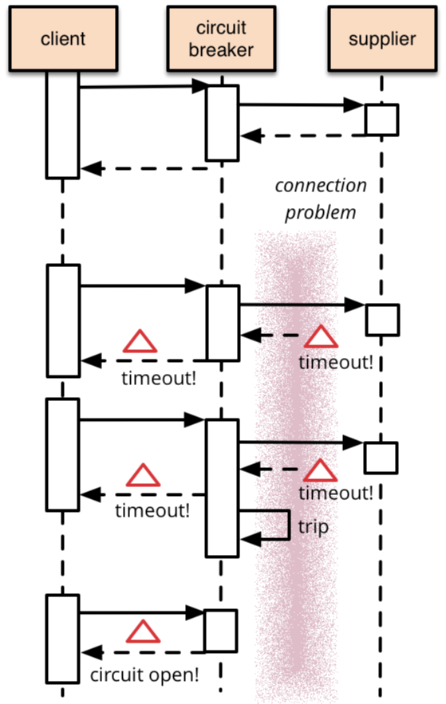

# 服务熔断 

[TOC]

## 使⽤ Hystrix 实现服务熔断 

### 断路器模式 

- 断路器 
  - Circuit Breaker pattern - Release It, Michael Nygard 
  - CircuitBreaker, Martin Fowler 
    - https://martinfowler.com/bliki/CircuitBreaker.html 
- 核⼼思想
  - 在断路器对象中封装受保护的⽅法调⽤ 
  - 该对象监控调⽤和断路情况 
  - 调⽤失败触发阈值后，后续调⽤直接由断路器返回错误，不再执⾏实际调⽤ 

------

------

### Netflix Hystrix 

- 实现了断路器模式 
- @HystrixCommand 
  - fallbackMethod / commandProperties 
    - @HystrixProperty(name="execution.isolation.strategy", value=“SEMAPHORE") 
  - https://github.com/Netflix/Hystrix/wiki/Configuration 

- Spring Cloud ⽀持 
  - spring-cloud-starter-netflix-hystrix 
  - @EnableCircuitBreaker 
- Feign ⽀持 
  - feign.hystrix.enabled=true 
  - @FeignClient 
    - fallback / fallbackFactory 

------

------

### 如何观察服务熔断 

#### 如何了解熔断的情况 

- 打⽇志 
  - 在发⽣熔断时打印特定该⽇志 
- 看监控 
  - 主动向监控系统埋点，上报熔断情况 
  - 提供与熔断相关的 Endpoint，让第三⽅系统来拉取信息 

#### Hystrix Dashboard 

- Spring Cloud 为我们提供了
  - Hystrix Metrics Stream 
    - spring-boot-starter-actuator 
      - /actuator/hystrix.stream 
- Hystrix Dashboard 
  - spring-cloud-starter-netflix-hystrix-dashboard 
    - @EnableHystrixDashboard 
    - /hystrix 

------

------

#### 聚合集群熔断信息 

- Spring Cloud 为我们提供了
  - Netflix Turbine 
    - spring-cloud-starter-netflix-turbines 
      - @EnableTurbine 
      - /turbine.stream?cluster=集群名 

------

------

## 使⽤ Resilience4j 实现服务熔断 

### Hystrix 以外的选择 

- Hystrix 
  - Netflix 停⽌维护，给了官⽅推荐 
- Resilience4j 
  - https://github.com/resilience4j/resilience4j 
  - ⼀款受 Hystrix 启发的轻量级且易于使⽤的容错库 
  - 针对 Java 8 与函数式编程设计 

### 核⼼组件 

|          组件名称           |       功能        |
| :-------------------------: | :---------------: |
| resilience4j-circuitbreaker | Circuit breaking  |
|  resilience4j-ratelimiter   |     频率控制      |
|    resilience4j-bulkhead    | 依赖隔离&负载保护 |
|     resilience4j-retry      |     ⾃动重试      |
|     resilience4j-cache      |     应答缓存      |
|  resilience4j-timelimiter   |     超时控制      |

### 附加组件 

|         组件名称          |          功能           |
| :-----------------------: | :---------------------: |
|   resilience4j-reactor    |   Spring Reactor ⽀持   |
|  resilience4j-micrometer  | Micrometer Metrics 输出 |
|  resilience4j-prometheus  | Prometheus Metrics 输出 |
| resilience4j-spring-boot2 |  Spring Boot 2 Starter  |
|    resilience4j-feign     |      Feign 适配器       |

### 断路器 

- 实现 
  - 基于  ConcurrentHashMap的内存断路器 
  - CircuitBreakerRegistry 
  - CircuitBreakerConfig 
- 依赖 
  - resilience4j-spring-boot2 
  - resilience4j-circuitbreaker 
  - resilience4j-micrometer 
  - …… 

- 注解⽅式 
  - @CircuitBreaker(name = "名称") 
- 配置 
  - CircuitBreakerProperties 
    - resilience4j.circuitbreaker.backends.名称 
      - failure-rate-threshold 
      - wait-duration-in-open-state 

------

------

## 使⽤ Resilience4j 实现服务限流 

### Bulkhead 

- ⽬的 
  - 防⽌下游依赖被并发请求冲击 
  - 防⽌发⽣连环故障 
- ⽤法 
  - BulkheadRegistry / BulkheadConfig 
  - @Bulkhead(name = "名称") 

- 配置 
  - BulkheadProperties 
    - resilience4j.bulkhead.backends.名称 
      - max-concurrent-call 
      - max-wait-time 

------

------

### RateLimiter 

- ⽬的 
  - 限制特定时间段内的执⾏次数 
- ⽤法 
  - RateLimiterRegistry / RateLimiterConfig 
  - @RateLimiter(name = "名称") 

- 配置 
  - RateLimiterProperties 
    - resilience4j.ratelimiter.limiters.名称 
      - limit-for-period 
      - limit-refresh-period-in-millis 
      - timeout-in-millis 

------

------

## SpringBucks 实战项⽬进度⼩结 

### 本章⼩结 

- ⼏种模式 
  - 断路器 / 隔舱 / 速率限制器 
- 两个⼯具 
  - Netflix Hystrix / Resilience4j 
  - 建议学习，Google Guava 
- 观察与监控
  - Hystrix Dashboard / Micrometer 

### SpringBucks 进度⼩结 

- waiter-service 
  - 使⽤ Resilience4j 的  RateLimiter进⾏防护 
- customer-service 
  - 使⽤ Hystrix 进⾏熔断 
  - 使⽤ Resilience4j 进⾏熔断和并发控制 

