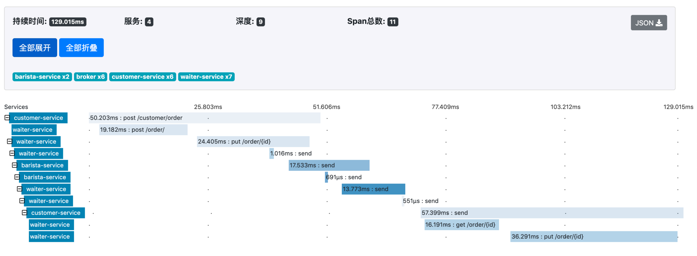

# 服务链路追踪

[TOC]


## 通过 Dapper 理解链路治理

### 我们在关注什么？ 

- 系统中都有哪些服务 
- 服务之间的依赖关系是什么样的 
- ⼀个常⻅请求具体的执⾏路径是什么样的 
- 请求每个环节的执⾏是否正常与耗时情况 
- …… 

### Google Dapper 的⼀些术语 

- Span - 基本的⼯作单元 
- Trace - 由⼀组 Span 构成的树形结构 
- Annotation - ⽤于及时记录事件 
  - cs - Client Sent 
  - sr - Server Received 
  - ss - Server Sent 
  - cr - Client Received 


## 通过 Spring Cloud Sleuth 实现链路追踪 

### Spring Cloud 提供的服务治理功能 

- 依赖 
  - Spring Cloud Sleuth - spring-cloud-starter-sleuth 
  - Spring Cloud Sleuth with Zipkin - spring-cloud-starter-zipkin 
- ⽇志输出
  - [appname,traceId,spanId,exportable] 

- 配置 

  ```yaml
  spring.zipkin.base-url=http://localhost:9411/ 
  
  spring.zipkin.discovery-client-enabled=false 
  
  spring.zipkin.sender.type=web | rabbit | kafka 
  
  spring.zipkin.compression.enabled=false 
  
  spring.sleuth.sampler.probability=0.1 
  ```

### 通过 Docker 启动 Zipkin 

- 官⽅指引 
  - https://hub.docker.com/r/openzipkin/zipkin 
  - https://github.com/openzipkin/docker-zipkin 
- 获取镜像 
  - docker pull openzipkin/zipkin 
- 运⾏ Zipkin 镜像 
  - docker run --name zipkin -d -p 9411:9411 openzipkin/zipkin 

------

------

## 如何追踪消息链路 

### ⽤ Spring Cloud Sleuth 追踪消息 

- 依赖 
  - Spring Cloud Sleuth with Zipkin - spring-cloud-starter-zipkin 
    - 如需通过 MQ 埋点，需增加 RabbitMQ 或 Kafka 依赖 
- 配置 
  - 如使⽤ HTTP 埋点，则与追踪 HTTP 服务完全⼀致 
  - spring.zipkin.sender.type=rabbit 
    - spring.zipkin.rabbitmq.queue=zipkin 
    - spring.rabbitmq.* 

### 让 Zipkin 能通过 RabbitMQ 接收消息 

- 环境变量 
  - RABBIT_ADDRESSES=<RabbitMQ地址> 
  - RABBIT_USER / RABBIT_PASSWORD 
  - https://github.com/apache/incubator-zipkin/tree/master/zipkin-collector/rabbitmq 
- 运⾏ Zipkin 镜像 
  - docker run --name rabbit-zipkin -d -p 9411:9411 --link rabbitmq -e RABBIT_ADDRESSES=rabbitmq:5672 -e RABBIT_USER=spring -e RABBIT_PASSWORD=spring openzipkin/ zipkin 

### 完整的应⽤链路 



------

------

## 除了链路还要追踪什么 

### 服务治理关⼼什么才好 

- 我们已经看过了 
  - 简单服务之间的依赖关系 
  - ⼀个请求的同步、异步链路 
- 我们还需要关注 
  - 很多……很多…… 

> “⼀个企业实施的⽤以保障事情正确完成的流程，即遵循最佳 实践，体系架构原则，治理条例，法律和其他决定因素。SOA 治理是指⽤于管理SOA的采⽤和实现的流程。” 
>
> ​																							– Anne Thomas Manes Wikipedia - SOA governance 

- 宏观上 
  - 架构设计是否合理 
  - 哪些链路算是关键链路 
  - 链路的容量⽔位趋势 
  - 对系统变更的管理与审计 
- 微观上 
  - ⼀个系统都依赖了什么 
  - ⼀个系统都有哪些配置 
  - ⼀个系统的主观与客观质量 
  - …… 

## SpringBucks 实战项⽬进度⼩结 

### 本章⼩结 

- Spring Cloud 的服务治理功能
  - 借鉴⾃ Google Dapper 
  - Spring Cloud Sleuth 
    - Zipkin 
      - Web 
      - RabbitMQ 
  - 我们应该关⼼更多 

### SpringBucks 进度⼩结 

- waiter-service / customer-service 
  - 增加基于 Web 向 Zipkin 埋点功能 
- barista-service 
  - 增加基于 MQ 向 Zipkin 埋点功能 
- 最终的成品 
  - 通过 Docker 运⾏整个 SpringBucks 

------

------

