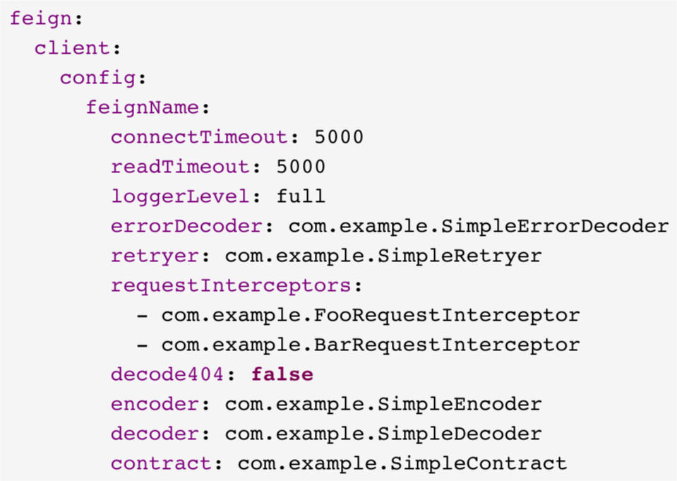
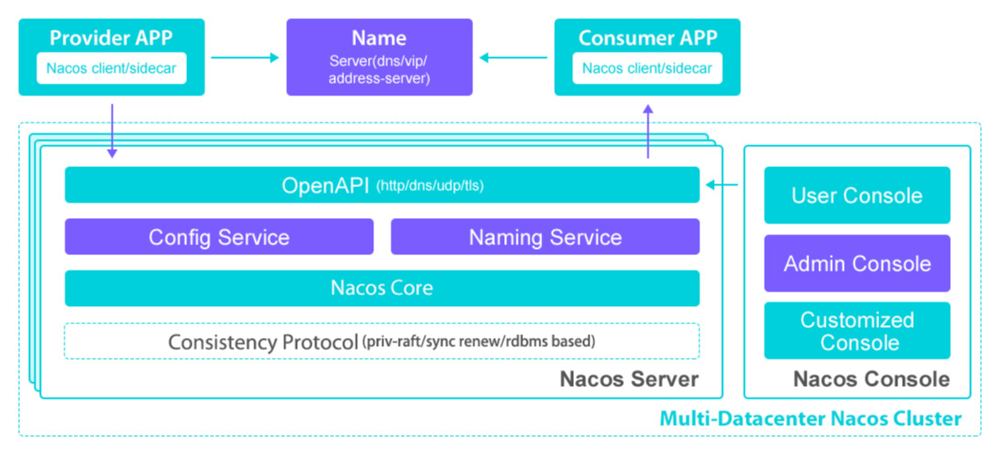

# 服务注册与发现 

[TOC]


## 使⽤ Eureka 作为服务注册中⼼ 

### 认识 Eureka 

- 什么是 Eureka 
  - Eureka 是在 AWS 上定位服务的 REST 服务 
- Netflix OSS 
  -  https://netflix.github.io 
- Spring 对 Netflix 套件的⽀持
  - Spring Cloud Netflix 

### 在本地启动⼀个简单的 Eureka 服务 

- Starter 
  - spring-cloud-dependencies 
  - spring-cloud-starter-netflix-eureka-starter 
- 声明
  - @EnableEurekaServer 
- 注意事项 
  - 默认端⼝8761 
  - Eureka ⾃⼰不要注册到 Eureka 了 

### 将服务注册到 Eureka Server 

- Starter 
  - spring-cloud-starter-netflix-eureka-client 
- 声明 
  - @EnableDiscoveryClient 
  - @EnableEurekaClient 
- ⼀些配置项 
  - eureka.client.service-url.default-zone 
  - eureka.client.instance.prefer-ip-address 

### 关于 Bootstrap 属性 

- Bootstrap 属性 
  - 启动引导阶段加载的属性 
  - bootstrap.properties | .yml 
  - spring.cloud.bootstrap.name=bootstrap 
- 常⽤配置 
  - spring.application.name=应⽤名 
  - 配置中⼼相关 

------

------

## 使⽤ Spring Cloud LoadBalancer 访问服务 

### 如何获得服务地址 

- EurekaClient 
  - getNextServerFromEureka() 
- DiscoveryClient 
  - getInstances() 

### Load Balancer Client 

#### RestTemplate 与 WebClient 

- @LoadBalaced 
  - 实际是通过  ClientHttpRequestInterceptor实现的 
  - LoadBalancerInterceptor 
    - LoadBalancerClient 
    - RibbonLoadBalancerClient 

------

------

## 使⽤ Feign 访问服务 

### 认识 Feign 

- Feign 
  - 声明式 REST Web 服务客户端 
  -  https://github.com/OpenFeign/feign 
- Spring Cloud OpenFeign
  - spring-cloud-starter-openfeign 

### Feign 的简单使⽤ 

- 开启 Feign ⽀持 
  - @EnableFeignClients 
- 定义 Feign 接⼝
  - @FeignClient 
- 简单配置 
  - FeignClientsConfiguration 
  - Encoder / Decoder / Logger / Contract / Client … 

### 通过配置定制 Feign 



### Feign 的⼀些其他配置 

```yaml
feign.okhttp.enabled=true 

feign.httpclient.enabled=true 

feign.compression.response.enabled=true 

feign.compression.request.enabled=true 

feign.compression.request.mime-types= text/xml,application/xml,application/json 

feign.compression.request.min-request-size=2048 
```

------

------

## 深⼊理解 DiscoveryClient 

### Spring Cloud Commons 提供的抽象 

- 服务注册抽象 
  - 提供了  ServiceRegistry抽象 
- 客户发现抽象
  - 提供了  DiscoveryClient抽象 
    - @EnableDiscoveryClient 
  - 提供了  LoadBalancerClient抽象 

### ⾃动向 Eureka 服务端注册 

- ServiceRegistry 
  - EurekaServiceRegistry 
  - EurekaRegistration 
- ⾃动配置 
  - EurekaClientAutoConfiguration 
  - EurekaAutoServiceRegistration 
    - SmartLifecycle 

## 使⽤ Zookeeper 作为服务注册中⼼ 

### 认识 Zookeeper 

- Zookeeper
  - A Distributed Coordination Service for Distributed Applications 
  - http://zookeeper.apache.org 
- 设计⽬标 
  - 简单 
  - 多副本 
  - 有序 
  - 快 

### 使⽤ Zookeeper 作为注册中⼼ 

- Spring Cloud Zookeeper 
  - spring-cloud-starter-zookeeper-discovery 
  - Apache Curator 
- 简单配置 
  - spring.cloud.zookeeper.connect-string=localhost:2181 
- 提示 
  - 注意 Zookeeper 的版本 
    - 3.5.x 还是 Beta，但很多⼈在⽣产中使⽤它 

### 使⽤ Zookeeper 作为注册中⼼的问题 

- 两篇⽂章值得阅读 
  - 《阿⾥巴巴为什么不⽤ Zookeeper 做服务发现》 
  - 《Eureka! Why You Shouldn’t Use ZooKeeper for Service Discovery》 
- 核⼼思想
  - 在实践中，注册中⼼不能因为⾃身的任何原因破坏服务之间本身的可连通性 
  - 注册中⼼需要 AP，⽽ Zookeeper 是 CP 
    - CAP - ⼀致性、可⽤性、分区容忍性 

### 通过 Docker 启动 Zookeeper 

- 官⽅指引 
  - https://hub.docker.com/_/zookeeper 
- 获取镜像 
  - docker pull zookeeper:3.5 
- 运⾏ Zookeeper 镜像 
  - docker run --name zookeeper -p 2181:2181 -d zookeeper:3.5 

------

------

## 使⽤ Consul 作为服务注册中⼼ 

> “Consul  is  a  distributed,  highly  available,  and  data  center aware solution to connect and configure applications across dynamic, distributed infrastructure.” 
>
> ​																												– https://github.com/hashicorp/consul 

### 认识 HashiCorp Consul 

- Consul 
  - https://www.consul.io 
- 关键特性 
  - 服务发现 
  - 健康检查 
  - KV 存储 
  - 多数据中⼼⽀持 
  - 安全的服务间通信 

### 使⽤ Consul 提供服务发现能⼒ 

- Consul 的能⼒ 
  - Service registry, integrated health checks, and DNS and HTTP interfaces enable any service to discover and be discovered by other services 
- 好⽤的功能 
  - HTTP API 
  - DNS（ xxx.service.consul ） 
  - 与 Nginx 联动，⽐如 ngx_http_consul_backend_module 

### 使⽤ Consul 作为注册中⼼ 

- Spring Cloud Consul 

  - spring-cloud-starter-consul-discovery 

- 简单配置 

  ```yaml
  spring.cloud.consul.host=localhost 
  
  spring.cloud.consul.port=8500 
  
  spring.cloud.consul.discovery.prefer-ip-address=true 
  ```

### 通过 Docker 启动 Consul 

- 官⽅指引 
  - https://hub.docker.com/_/consul 
- 获取镜像 
  - docker pull consul 
- 运⾏ Consul 镜像 
  - docker run --name consul -d -p 8500:8500 -p 8600:8600/udp consul 

------

------

## 使⽤ Nacos 作为服务注册中⼼ 

### 认识 Nacos 

- Nacos 
  - ⼀个更易于构建云原⽣应⽤的动态服务发现、配置管理和服务管理平台。 
  - https://nacos.io/zh-cn/index.html 
- 功能 
  - 动态服务配置 
  - 服务发现和管理 
  - 动态 DNS 服务 



### 使⽤ Nacos 作为注册中⼼ 

- Spring Cloud Alibaba
  - spring-cloud-alibaba-dependencies 
  - spring-cloud-starter-alibaba-nacos-discovery 
- 简单配置 
  - spring.cloud.nacos.discovery.server-addr 

### 通过 Docker 启动 Nacos 

- 官⽅指引 
  - https://hub.docker.com/r/nacos/nacos-server 
- 获取镜像 
  - docker pull nacos/nacos-server 
- 运⾏ Nacos 镜像 
  - docker run --name nacos -d -p 8848:8848 -e MODE=standalone nacos/nacos-server 
  - ⽤户名密码为 nacos 

------

------

## 如何定制⾃⼰的 DiscoveryClient 

### 已经接触过的 Spring Cloud 类 

- DiscoveryClient 
  - EurekaDiscoveryClient 
  - ZookeeperDiscoveryClient 
  - ConsulDiscoveryClient 
  - NacosDiscoveryClient 
- LoadBalancerClient 
  - RibbonLoadBalancerClient 

### 实现⾃⼰的 DiscoveryClient 

- 需要做的： 
  - 返回该  DiscoveryClient能提供的服务名列表 
  - 返回指定服务对应的  ServiceInstance列表 
  - 返回  DiscoveryClient的顺序 
  - 返回  HealthIndicator⾥显示的描述 

### 实现⾃⼰的 RibbonClient ⽀持 

- 需要做的： 
  - 实现⾃⼰的  ServerList<T extends Server> 
  - Ribbon 提供了  AbstractServerList<T extends Server> 
  - 提供⼀个配置类，声明  ServerList Bean 实例 

------

------

## SpringBucks 实战项⽬进度⼩结 

### 本章⼩结 

- 各种服务注册中⼼ 
  - Eureka、Zookeeper、Consul、Nacos 
- 如何在服务间进⾏负载均衡 
  - Ribbon、OpenFeign 
- Spring Cloud 的服务注册与发现机制 
  - ServiceRegistry、DiscoveryClient 
  - LoadBalancerClient 

### SpringBucks 进度⼩结 

- waiter-service 
  - 使⽤多种服务注册中⼼注册服务 
  - Eureka、Zookeeper、Consul、Nacos 
- customer-service 
  - 通过多种服务注册中⼼发现 waiter-service 
  - Eureka、Zookeeper、Consul、Nacos 
