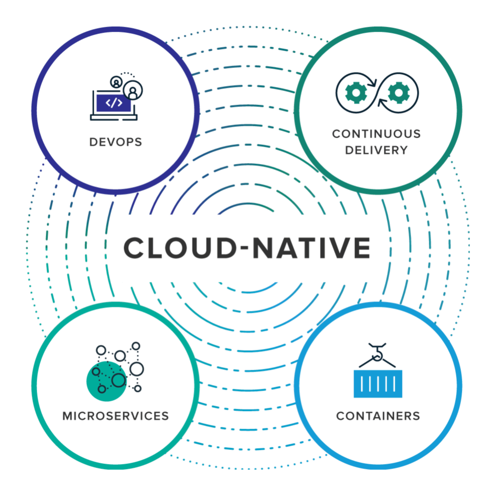
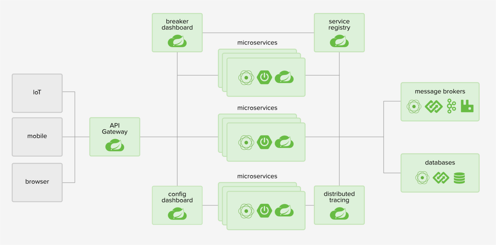

# Spring Cloud 云原⽣应⽤

[TOC]

## Spring Cloud 及 Cloud Native 概述

### 简单理解微服务

> “微服务就是⼀些协同⼯作的⼩⽽⾃治的服务。”																			– Sam Newman

#### 微服务的优点

- 异构性
  - 语⾔、存储……
- 弹性
  - ⼀个组件不可⽤，不会导致级联故障
- 扩展
  - 单体服务不易扩展，多个较⼩的服务可以按需扩展

- 易于部署
- 与组织结构对⻬
- 可组合性
- 可替代性

#### 实施微服务的代价 

- 没有银弹！！！ 
- 分布式系统的复杂性 
- 开发、测试等诸多研发过程中的复杂性 
- 部署、监控等诸多运维复杂性 
- …… 

### 如何理解云原⽣ 

> “云原⽣技术有利于各组织在公有云、私有云和混合云等新型动态环 境中，构建和运⾏可弹性扩展的应⽤。” 
>
> ​																														– CNCF Cloud Native Definition v1.0 

#### 云原⽣应⽤要求…… 

- DevOps 
  - 开发与运维⼀同致⼒于交付⾼品质的软件服务于客户 
- 持续交付
  - 软件的构建、测试和发布，要更快、更频繁、更稳定 
- 微服务
  - 以⼀组⼩型服务的形式来部署应⽤ 
- 容器
  - 提供⽐传统虚拟机更⾼的效率 

#### Cloud Native Computing Foundation 

### 12-Factor App 

#### THE TWELVE-FACTOR APP 

- ⽬的 
  - 为构建 SaaS 应⽤提供⾏之有效的⽅法论 
  - 适⽤于任意语⾔和后端服务的开发的应⽤程序 
  - https://12factor.net/zh_cn/ 

#### 了解 12-Factors 

- 基准代码（Codebase） 
  - ⼀份基准代码，多份部署 
- 依赖（Dependencies）
  - 显式声明依赖关系 
- 配置（Config） 
  - 在环境中存储配置 
- 后端服务（Backing services）
  - 把后端服务当作附加资源 

- 构建，发布，运⾏（Build, release, run） 
  - 严格分离构建和运⾏ 
- 进程（Processes）
  - 以⼀个或多个⽆状态进程运⾏应⽤ 
- 端⼝绑定（Port Binding）
  - 通过端⼝绑定提供服务 
- 并发（Concurrency） 
  - 通过进程模型进⾏扩展 

- 易处理（Disposability） 
  - 快速启动和优雅终⽌可最⼤化健壮性 
- 开发环境与线上环境等价（Dev / Prod parity）
  - 尽可能的保持开发，预发布，线上环境相同 
- ⽇志（Logs） 
  - 把⽇志当作事件流 
- 管理进程（Admin processes） 
  - 后台管理任务当作⼀次性进程运⾏ 

### 12-Factor App 特点

#### ⼀份基准代码，多份部署 

- 使⽤版本控制系统加以管理 
- 基准代码与应⽤保持⼀⼀对应的关系 
- 尽管每个应⽤只对应⼀份基准代码，但可以同时存在多份部署 

#### 显式声明依赖关系 

- 12-Factor 的应⽤程序不会隐式依赖系统级的类库 
- 它⼀定通过依赖清单，确切地声明所有依赖项 
- 在运⾏过程中，通过依赖隔离⼯具来确保程序不会调⽤系统中存在但清单中未声明的依赖项 

#### 严格分离构建和运⾏ 

- 12-Facfor 应⽤严格区分构建、发布、运⾏三个步骤 
- 部署⼯具通常都提供了发布管理⼯具 
- 每⼀个发布版本必须对应⼀个唯⼀的发布 ID 

#### 以⼀个或多个⽆状态进程运⾏应⽤ 

- 12-Factor 应⽤的进程必须⽆状态且⽆共享 
- 任何需要持久化的数据都要存储在后端服务内 

#### 快速启动和优雅终⽌可最⼤化健壮性 

- 进程应当追求最⼩启动时间 
- 进程⼀旦接收终⽌信号就会优雅的终⽌ 
- 进程应当在⾯对突然死亡时保持健壮 

#### 尽可能的保持开发，预发布，线上环境相同 

- 想要做到持续部署就必须缩⼩本地与线上差异 
- 后端服务是保持开发与线上等价的重要部分 
- 应该反对在不同环境间使⽤不同的后端服务 

## 认识 Spring Cloud 的组成部分 

> “Spring Cloud offers a simple and accessible programming model  to  the  most  common  distributed  system  patterns, helping developers build resilient, reliable, and coordinated applications.” 
>
> ​																																								– Spring 官⽹ 

### Spring Cloud 

### Spring Cloud 的主要功能 

- 服务发现 
- 服务熔断 
- 配置服务 
- 服务安全 
- 服务⽹关 
- 分布式消息 
- 分布式跟踪 
- 各种云平台⽀持 

### Spring Cloud 的版本号规则 

- Spring Cloud 是个⼤⼯程，其中包含多个独⽴项⽬ 
- BOM - Release Train 
  - London Tube Stations 
  - 字⺟序排列 
    - Greenwich, Finchley, Edgware … 
  - SR - Service Release 