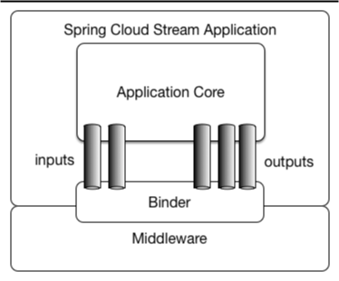
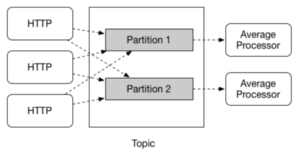
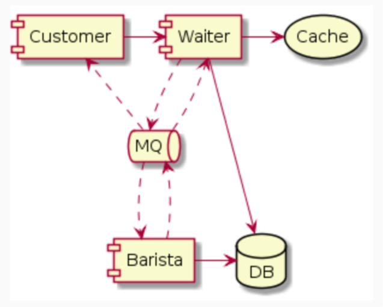
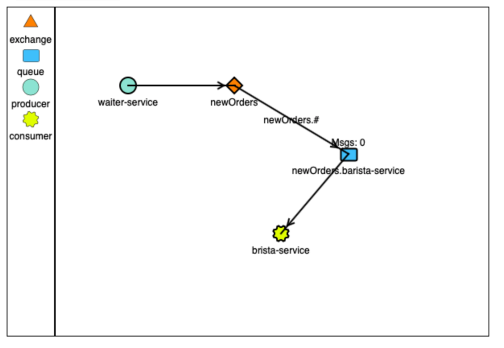

# Spring Cloud Stream

[TOC]

## 认识 Spring Cloud Stream

### Spring Cloud Stream 

- Spring Cloud Stream 是什么 
  - ⼀款⽤于构建消息驱动的微服务应⽤程序的轻量级框架 
- 特性 
  - 声明式编程模型 
  - 引⼊多种概念抽象 
    - 发布订阅、消费组、分区 
  - ⽀持多种消息中间件 
    - RabbitMQ、Kafka …… 

### Spring Cloud Stream 的⼀些核⼼概念 

#### Binder 

- RabbitMQ 
- Apache Kafka 
- Kafka Streams 
- Amazon Kinesis 
- RocketMQ 
- …… 

#### Binding 

- 应⽤中⽣产者、消费者与消息系统之间的桥梁 
  - @EnableBinding 
  - @Input / SubscribableChannel 
  - @Output / MessageChannel 

#### 消费组 

- 对同⼀消息，每个组中都会有⼀个消费者收到消息 

#### 分区 

### 如何发送与接收消息 

- ⽣产消息 
  - 使⽤  MessageChannel中的  send() 
  - @SendTo 
- 消费消息
  - @StreamListener 
    - @Payload / @Headers / @Header 
- 其他说明
  - 可以使⽤ Spring Integration 

## 通过 Spring Cloud Stream 访问 RabbitMQ 

> “RabbitMQ is the most widely deployed open source message broker.”							 
>
> ​																																						– RabbitMQ 官⽹ 

### Spring Cloud Stream 对 RabbitMQ 的⽀持 

- 依赖 
  - Spring Cloud - spring-cloud-starter-stream-rabbit 
  - Spring Boot - spring-boot-starter-amqp 
- 配置 
  - spring.cloud.stream.rabbit.binder.* 
  - spring.cloud.stream.rabbit.bindings.<channelName>.consumer.* 
  - spring.rabbitmq.* 

### 通过 Docker 启动 RabbitMQ 

- 官⽅指引 
  - https://hub.docker.com/_/rabbitmq 
- 获取镜像 
  - docker pull rabbitmq 
  - docker pull rabbitmq:3.7-management 
- 运⾏ RabbitMQ 镜像 
  - docker run --name rabbitmq -d -p 5672:5672 -p 15672:15672 -e RABBITMQ_DEFAULT_USER=spring -e RABBITMQ_DEFAULT_PASS=spring rabbitmq:3.7-management 

### 回顾 SpringBucks 的⽬标 

### 消息在 RabbitMQ 的流转 

------

------

## 通过 Spring Cloud Stream 访问 Kafka 

### 认识 Apache Kafka 

- 什么是 Kafka 
  - 诞⽣之初被⽤作消息队列，现已发展为强⼤的分布式事件流平台 
  - LinkedIn 在 2011 年开源 

### Spring Cloud Stream 对 Kafka 的⽀持 

- 依赖 
  - Spring Cloud - spring-cloud-starter-stream-kafka 
- 配置 
  - spring.cloud.stream.kafka.binder.* 
  - spring.cloud.stream.kafka.bindings.<channelName>.consumer.* 
  - spring.kafka.* 

### 通过 Docker 启动 Kafka 

- 官⽅指引 
  - https://hub.docker.com/r/confluentinc/cp-kafka 
  - https://docs.confluent.io/current/quickstart/cos-docker-quickstart.html 
- 运⾏镜像 
  - https://github.com/confluentinc/cp-docker-images 
    - kafka-single-node/docker-compose.yml 
  - docker-compose up -d 

------

------

### Spring 中的定时任务 

- Spring 的抽象 
  - TaskScheduler / Trigger / TriggerContext 
- 配置定时任务
  - @EnableScheduling 
  - <task:scheduler /> 
  - @Scheduled 

### Spring 中的事件机制 

- Spring 中的事件
  - ApplicationEvent 
- 发送事件
  - ApplicationEventPublisherAware 
  - ApplicationEventPublisher.publishEvent() 
- 监听事件 
  - ApplicationListener<T> 
  - @EventListener 

------

------

## SpringBucks 实战项⽬进度⼩结 

### 本章⼩结 

- Spring Cloud Stream 
  - Spring Cloud Stream 对消息的抽象 
  - 对不同中间件的⽀持 
    - RabbitMQ 
    - Apache Kafka 
- Spring 的⼀些机制 
  - 上下⽂中的事件机制 
  - 定时任务 

### SpringBucks 进度⼩结 

- waiter-service 
  - 增加⽀付功能 
  - 在⽀付后发送消息通知制作订单 
  - 接收订单完成通知 
- customer-service 
  - 增加⽀付功能 
  - 查询订单状态并取⾛咖啡 
- barista-service 
  - 等待通知制作订单

------

------

