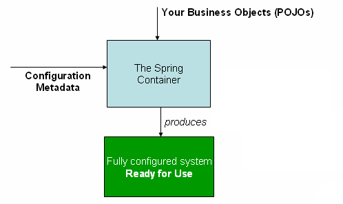
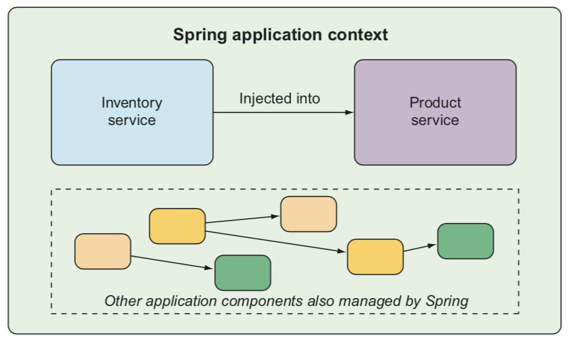
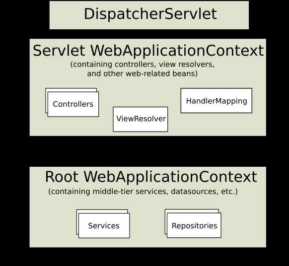
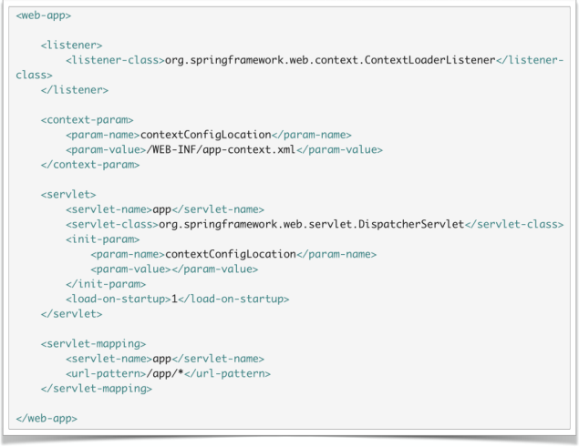
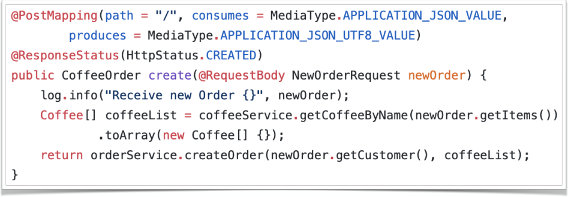
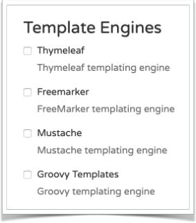
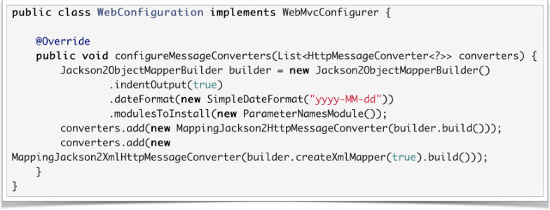
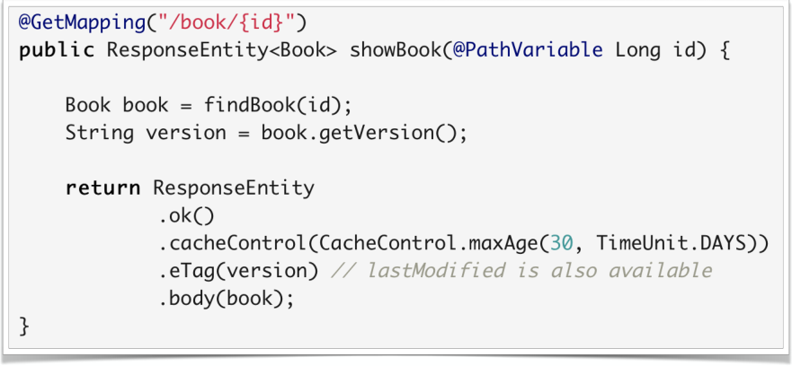
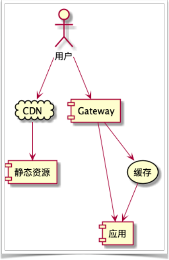

# 谈谈 Web 那些事-Spring MVC 实践

[TOC]

------


## 编写第一个Spring MVC Controller

- ### 认识 Spring MVC

  - DispatcherServlet

  - Controller

  - xxxResolver

  - ViewResolver

  - HandlerExceptionResolver

  - MultipartResolver

  - HandlerMapping

- ### Spring MVC 中的常⽤注解

  - @Controller

  - @RestController

  - @RequestMapping

  - @GetMapping / @PostMapping

  - @PutMapping / @DeleteMapping

  - @RequestBody / @ResponseBody / @ResponseStatus

---
代码示例

- model层

  Coffee

  

  ```java
  @Data
  @Builder
  @Entity
  @Table(name = "T_COFFEE")
  @AllArgsConstructor
  @NoArgsConstructor
  @ToString(callSuper = true)
  @EqualsAndHashCode(callSuper = true)
  public class Coffee extends BaseEntity implements Serializable {
  
      private String name;
  
      @Type(type = "org.jadira.usertype.moneyandcurrency.joda.PersistentMoneyMinorAmount",
      parameters = {@org.hibernate.annotations.Parameter(name = "currencyCode",value = "CNY")})
      private Money price;
  
  }
  ```

  CoffeeOrder

  

  ```java
  @Builder
  @AllArgsConstructor
  @NoArgsConstructor
  @ToString(callSuper = true)
  @EqualsAndHashCode(callSuper = true)
  @Data
  @Table(name = "T_ORDER")
  @Entity
  public class CoffeeOrder extends BaseEntity implements Serializable {
  
      private String customer;
  
      @ManyToMany
      @JoinTable(name = "T_ORDER_COFFEE")
      @OrderBy("id")
      private List<Coffee> items;
  
      @Enumerated
      @Column(nullable = false)
      private OrderState state;
  }
  ```

  BaseEntity

  

  ```java
  @MappedSuperclass
  @Data
  @NoArgsConstructor
  @AllArgsConstructor
  public class BaseEntity implements Serializable {
  
      @Id
      @GeneratedValue(strategy = GenerationType.IDENTITY)
      private Long id;
  
      @CreationTimestamp
      @Column(updatable = false)
      private Date createTime;
  
      @UpdateTimestamp
      private Date updateTime;
  
  }
  ```

  OrderState

  

  ```java
  public enum OrderState {
      INIT, PAID, BREWING, BREWED, TAKEN, CANCELLED
  }
  ```

  

- repository层

  CoffeeRepository

  

  ```java
  public interface CoffeeRepository extends JpaRepository<Coffee, Long> {
      public List<Coffee> findByNameInOrderById(List<String> list);
  }
  ```

  CoffeeOrderRepository

  

  ```java
  public interface CoffeeOrderRepository extends JpaRepository<CoffeeOrder,Long> {
  }
  ```

  

- service层

  CoffeeService

  

  ```java
  @Slf4j
  @Service
  @CacheConfig(cacheNames = "CoffeeCache")
  public class CoffeeService {
  
      @Autowired
      private CoffeeRepository coffeeRepository;
  
      @Cacheable
      public List<Coffee> findAllCoffee() {
  
          return coffeeRepository.findAll(Sort.by("id"));
      }
  
      public List<Coffee> getCoffeeByName(List<String> names) {
  
          return coffeeRepository.findByNameInOrderById(names);
      }
  }
  ```

  CoffeeOrderService

  

  ```java
  @Service
  @Slf4j
  @Transactional
  public class CoffeeOrderService {
  
      @Autowired
      private CoffeeOrderRepository orderRepository;
  
      public CoffeeOrder createOrder(String customer, Coffee... coffees) {
  
          CoffeeOrder order = CoffeeOrder.builder()
                  .customer(customer)
                  .items(Arrays.asList(coffees))
                  .state(OrderState.INIT)
                  .build();
  
          CoffeeOrder saved = orderRepository.save(order);
  
          log.info("New order:{}",saved);
          return saved;
      }
  
      public boolean updateState(CoffeeOrder order,OrderState state){
  
          if (state.compareTo(order.getState())<=0){
              log.warn("Wrong State order: {}, {}", state, order.getState());
              return false;
          }
          order.setState(state);
          orderRepository.save(order);
          log.info("Updated Order: {}", order);
          return true;
      }
  }
  ```

  

- controller层

  CoffeeController

  

  ```java
  @Controller
  @RequestMapping("/coffee")
  public class CoffeeController {
      @Autowired
      private CoffeeService coffeeService;
  
      @GetMapping("/")
      @ResponseBody
      public List<Coffee> getAll() {
          return coffeeService.findAllCoffee();
      }
  }
  ```

  CoffeeOrderController

  

  ```java
  @RestController
  @RequestMapping("/order")
  @Slf4j
  public class CoffeeOrderController {
      @Autowired
      private CoffeeOrderService orderService;
      @Autowired
      private CoffeeService coffeeService;
  
      @PostMapping("/")
      @ResponseStatus(HttpStatus.CREATED)
      public CoffeeOrder create(@RequestBody NewOrderRequest newOrder) {
          log.info("Receive new Order {}", newOrder);
          Coffee[] coffeeList = coffeeService.getCoffeeByName(newOrder.getItems())
                  .toArray(new Coffee[] {});
          return orderService.createOrder(newOrder.getCustomer(), coffeeList);
      }
  }
  ```

  

- 主启动类

  Application

  

  ```java
  @EnableCaching
  @EnableJpaRepositories
  @SpringBootApplication
  public class SimpleControllerDemoApplication {
  
      public static void main(String[] args) {
          SpringApplication.run(SimpleControllerDemoApplication.class, args);
      }
  
  }
  ```

运行结果

- “http://localhost:8080/coffee/” 接口访问

  

  ```json
  [{"id":1,"createTime":"2020-03-17T07:40:15.695+0000","updateTime":"2020-03-17T07:40:15.695+0000","name":"espresso","price":{"zero":false,"negative":false,"positive":true,"scale":2,"amount":20.00,"amountMajorLong":20,"amountMinor":2000,"amountMinorInt":2000,"amountMinorLong":2000,"minorPart":0,"currencyUnit":{"code":"CNY","numericCode":156,"decimalPlaces":2,"symbol":"￥","pseudoCurrency":false,"numeric3Code":"156","countryCodes":["CN"]},"amountMajor":20,"amountMajorInt":20,"positiveOrZero":true,"negativeOrZero":false}},{"id":2,"createTime":"2020-03-17T07:40:15.701+0000","updateTime":"2020-03-17T07:40:15.701+0000","name":"latte","price":{"zero":false,"negative":false,"positive":true,"scale":2,"amount":25.00,"amountMajorLong":25,"amountMinor":2500,"amountMinorInt":2500,"amountMinorLong":2500,"minorPart":0,"currencyUnit":{"code":"CNY","numericCode":156,"decimalPlaces":2,"symbol":"￥","pseudoCurrency":false,"numeric3Code":"156","countryCodes":["CN"]},"amountMajor":25,"amountMajorInt":25,"positiveOrZero":true,"negativeOrZero":false}},{"id":3,"createTime":"2020-03-17T07:40:15.701+0000","updateTime":"2020-03-17T07:40:15.701+0000","name":"capuccino","price":{"zero":false,"negative":false,"positive":true,"scale":2,"amount":25.00,"amountMajorLong":25,"amountMinor":2500,"amountMinorInt":2500,"amountMinorLong":2500,"minorPart":0,"currencyUnit":{"code":"CNY","numericCode":156,"decimalPlaces":2,"symbol":"￥","pseudoCurrency":false,"numeric3Code":"156","countryCodes":["CN"]},"amountMajor":25,"amountMajorInt":25,"positiveOrZero":true,"negativeOrZero":false}},{"id":4,"createTime":"2020-03-17T07:40:15.701+0000","updateTime":"2020-03-17T07:40:15.701+0000","name":"mocha","price":{"zero":false,"negative":false,"positive":true,"scale":2,"amount":30.00,"amountMajorLong":30,"amountMinor":3000,"amountMinorInt":3000,"amountMinorLong":3000,"minorPart":0,"currencyUnit":{"code":"CNY","numericCode":156,"decimalPlaces":2,"symbol":"￥","pseudoCurrency":false,"numeric3Code":"156","countryCodes":["CN"]},"amountMajor":30,"amountMajorInt":30,"positiveOrZero":true,"negativeOrZero":false}},{"id":5,"createTime":"2020-03-17T07:40:15.702+0000","updateTime":"2020-03-17T07:40:15.702+0000","name":"macchiato","price":{"zero":false,"negative":false,"positive":true,"scale":2,"amount":30.00,"amountMajorLong":30,"amountMinor":3000,"amountMinorInt":3000,"amountMinorLong":3000,"minorPart":0,"currencyUnit":{"code":"CNY","numericCode":156,"decimalPlaces":2,"symbol":"￥","pseudoCurrency":false,"numeric3Code":"156","countryCodes":["CN"]},"amountMajor":30,"amountMajorInt":30,"positiveOrZero":true,"negativeOrZero":false}}]
  ```

  

---

## 理解 Spring 的应⽤上下⽂

- ### Spring 的应⽤程序上下⽂
  
  

  

  
  
  
  
  
  
- ### 关于上下文常用的接⼝

  - BeanFactory

  - DefaultListableBeanFactory

  - ApplicationContext

  - ClassPathXmlApplicationContext

  - FileSystemXmlApplicationContext

  - AnnotationConfigApplicationContext

  - WebApplicationContext

- ### Web 上下文层次

  

  

  

---
- 通过演示上下文获取Bean来实现代理的功能

- 代码

  - TestBean实体类

    ```java
    @Slf4j
    @AllArgsConstructor
    public class TestBean {
    
        private String context;
    
        public void hello(){
            log.info("hello: "+context);
        }
    }
    ```

  - FooConfig配置类

    ```java
    @Configuration
    @EnableAspectJAutoProxy
    public class FooConfig {
    
        @Bean
        public TestBean testBeanX(){
            return new TestBean("FOO");
        }
    
        @Bean
        public TestBean testBeanY(){
            return new TestBean("FOO");
        }
    
        @Bean
        public FooAspect fooAspect(){
            return new FooAspect();
        }
    }
    ```

  - FooAspect代理类

    ```java
    @Aspect
    @Slf4j
    public class FooAspect {
    
        @AfterReturning("bean(testBean*)")
        public void printAfter(){
            log.info("after hello...");
        }
    }
    ```

  - Application主启动类

    ```java
    @Slf4j
    @SpringBootApplication
    public class ComplexHierarchyDemoApplication implements ApplicationRunner {
    
        public static void main(String[] args) {
            SpringApplication.run(ComplexHierarchyDemoApplication.class, args);
        }
    
        @Override
        public void run(ApplicationArguments args) throws Exception {
    
            ApplicationContext fooContex = new AnnotationConfigApplicationContext(FooConfig.class);
            ApplicationContext barContext = new ClassPathXmlApplicationContext(
                    new String[]{"applicationContext.xml"}, fooContex);
    
            TestBean testBeanX = fooContex.getBean("testBeanX", TestBean.class);
            testBeanX.hello();
    
            log.info("====================");
    
            TestBean bar1 = barContext.getBean("testBeanX", TestBean.class);
            bar1.hello();
    
            TestBean bar2 = barContext.getBean("testBeanY", TestBean.class);
            bar2.hello();
        }
    }
    ```

  - applicationContext配置文件

    ```xml
    <beans xmlns="http://www.springframework.org/schema/beans"
           xmlns:xsi="http://www.w3.org/2001/XMLSchema-instance"
           xmlns:aop="http://www.springframework.org/schema/aop"
           xsi:schemaLocation="http://www.springframework.org/schema/beans
            http://www.springframework.org/schema/beans/spring-beans.xsd
            http://www.springframework.org/schema/aop
            http://www.springframework.org/schema/aop/spring-aop.xsd">
        <aop:aspectj-autoproxy/>
        <bean id="testBeanX" class="com.simon.complexhierarchydemo.context.TestBean">
            <constructor-arg name="context" value="Bar" />
        </bean>
        <!--<bean id="fooAspect" class="geektime.spring.web.foo.FooAspect" />-->
    </beans>
    ```

- 运行结果

  ```yaml
  2020-04-03 16:19:31.410  INFO 19012 --- [           main] c.s.c.c.ComplexHierarchyDemoApplication  : Started ComplexHierarchyDemoApplication in 1.225 seconds (JVM running for 2.158)
  2020-04-03 16:19:31.801  INFO 19012 --- [           main] c.s.c.context.TestBean                   : hello: FOO
  2020-04-03 16:19:31.802  INFO 19012 --- [           main] c.s.complexhierarchydemo.foo.FooAspect   : after hello...
  2020-04-03 16:19:31.802  INFO 19012 --- [           main] c.s.c.c.ComplexHierarchyDemoApplication  : ====================
  2020-04-03 16:19:31.803  INFO 19012 --- [           main] c.s.c.context.TestBean                   : hello: Bar
  2020-04-03 16:19:31.803  INFO 19012 --- [           main] c.s.complexhierarchydemo.foo.FooAspect   : after hello...
  2020-04-03 16:19:31.803  INFO 19012 --- [           main] c.s.c.context.TestBean                   : hello: FOO
  2020-04-03 16:19:31.803  INFO 19012 --- [           main] c.s.complexhierarchydemo.foo.FooAspect   : after hello...
  ```

---

## Spring MVC 中的各种机制-请求处理

- ### Spring MVC 的请求处理流程

  

- ### 一个请求的大致处理流程
  
1. 绑定一些 Attribute
  
    - WebApplicationContext / LocaleResolver / ThemeResolver
2. 处理 Multipart
  
    - 如果是，则将请求转为 MultipartHttpServletRequest
3. Handler 处理
  
    - 如果找到对应 Handler，执⾏ Controller 及前后置处理器逻辑
4. 处理返回的 Model ，呈现视图

- ### 如何定义处理方法

  - 定义映射关系
    - @Controller
    - @RequestMapping

      - path / method 指定映射路路径与⽅方法

      - params / headers 限定映射范围

      - consumes / produces 限定请求与响应格式
    - 一些快捷⽅方式

      - @RestController

      - @GetMapping / @PostMapping / @PutMapping / @DeleteMapping / @PatchMapping

  - 定义处理方法

    - @RequestBody / @ResponseBody / @ResponseStatus

    - @PathVariable / @RequestParam / @RequestHeader

    - HttpEntity / ResponseEntity

    - 详细参数

      - <https://docs.spring.io/spring/docs/5.1.5.RELEASE/spring-framework-reference/web.html#mvc-ann-arguments>

    - 详细返回

      - <https://docs.spring.io/spring/docs/5.1.5.RELEASE/spring-framework-reference/web.html#mvc-ann-return-types>

---

  - 方法示例
  
    
    

---

  - 定义类型转换
    - 自⼰实现 WebMvcConfigurer

      - Spring Boot 在 WebMvcAutoConfiguration 中实现了一个

          WebMvcAutoConfigurationSupport

      - 添加⾃自定义的 Converter
    
      - 添加⾃自定义的 Formatter
    
  - 定义校验
    - 通过 Validator 对绑定结果进行校验
      - Hibernate Validator

    - @Valid 注解

    - BindingResult

  - Multipart 上传
    - 配置 MultipartResolver

      - Spring Boot 自动配置 MultipartAutoConfiguration

    - 支持类型 multipart/form-data

    - MultipartFile 类型

---
-   MoneyFormatter

```java
@Component
public class MoneyFormatter implements Formatter<Money> {
    @Override
    public Money parse(String s, Locale locale) throws ParseException {
        if (NumberUtils.isParsable(s)) {
            return Money.of(CurrencyUnit.of("CNY"), NumberUtils.createBigDecimal(s));
        } else if (StringUtils.isNotEmpty(s)) {
            String[] split = StringUtils.split(s, " ");
            if (split != null && split.length == 2 && NumberUtils.isParsable(split[1])) {
                return Money.of(CurrencyUnit.of(split[0]), NumberUtils.createBigDecimal(split[1]));
            } else {
                throw new ParseException(s, 0);
            }
        }
        throw new ParseException(s, 0);
    }

    @Override
    public String print(Money money, Locale locale) {
        if (money == null) {
            return null;
        }
        return money.getCurrencyUnit().getCode() + " " + money.getAmount();
    }
}
```

CoffeeController

```java
@Controller
@RequestMapping("/coffee")
@Slf4j
public class CoffeeController {
    @Autowired
    private CoffeeService coffeeService;

    @PostMapping(path = "/", consumes = MediaType.APPLICATION_FORM_URLENCODED_VALUE)
    @ResponseBody
    @ResponseStatus
    public Coffee addCoffee(@Valid NewCoffeeRequest coffeeRequest, BindingResult result) {
        if (result.hasErrors()) {
            log.warn("Binding errors:{}", result);
            return null;
        }
        return coffeeService.saveCoffee(coffeeRequest.getName(), coffeeRequest.getPrice());
    }

    @PostMapping(path = "/add", consumes = MediaType.APPLICATION_FORM_URLENCODED_VALUE)
    @ResponseBody
    @ResponseStatus(HttpStatus.CREATED)
    public Coffee addCoffeeWithoutBindingResult(@Valid NewCoffeeRequest newCoffee) {
        return coffeeService.saveCoffee(newCoffee.getName(), newCoffee.getPrice());
    }

    @PostMapping(path = "/", consumes = MediaType.MULTIPART_FORM_DATA_VALUE)
    @ResponseBody
    @ResponseStatus(HttpStatus.CREATED)
    public List<Coffee> batchAddCoffee(@RequestParam(name = "file") MultipartFile file) {
        List<Coffee> coffees = new ArrayList<>();
        if (!file.isEmpty()) {
            BufferedReader reader = null;
            try {
                reader = new BufferedReader(new InputStreamReader(file.getInputStream()));
                String str;
                while ((str = reader.readLine()) != null) {
                    String[] arr = StringUtils.split(str, " ");
                    if (arr != null && arr.length == 2) {
                        coffees.add(coffeeService.saveCoffee(arr[0],
                            Money.of(CurrencyUnit.of("CNY"), NumberUtils.createBigDecimal(arr[1]))));
                    }
                }
            } catch (IOException exception) {
                log.error("upload catch exception:", exception);
            } finally {
                IOUtils.closeQuietly(reader);
            }
        }
        return coffees;
    }

    @GetMapping(path = "/", params = "!name")
    @ResponseBody
    public List<Coffee> getAll() {
        return this.coffeeService.getAllCoffee();
    }

    @RequestMapping(path = "/{id}", method = RequestMethod.GET, produces = MediaType.APPLICATION_JSON_UTF8_VALUE)
    public Coffee getById(@PathVariable Long id) {
        return this.coffeeService.getCoffee(id);
    }

    @GetMapping(path = "/", params = "name")
    public Coffee getByName(@RequestParam String name) {
        return this.coffeeService.getCoffeeByName(name);
    }
}
```


---

## Spring MVC 中的各种机制-视图处理

- ### 视图解析的实现基础
  
  - ViewResolver 与 View 接⼝

    - AbstractCachingViewResolver

        抽象的基类，实现缓存的视图

    - UrlBasedViewResolver

    - FreeMarkerViewResolver

        使用了FreeMarker
  
    - ContentNegotiatingViewResolver
    
        可配置使用json，也可配置使用xml
    
    - InternalResourceViewResolver
    
        用于处理jsp和jstl
  
- ### DispatcherServlet 中的视图解析逻辑


  - initStrategies()

    - initViewResolvers() 初始化了对应 ViewResolver

  - doDispatch()

    - processDispatchResult()

      - 没有返回视图的话，尝试 RequestToViewNameTranslator

      - resolveViewName() 解析 View 对象

  - 使用 @ResponseBody 的情况

  - 在 HandlerAdapter.handle() 的中完成了Response 输出

    - RequestMappingHandlerAdapter.invokeHandlerMethod()

      - HandlerMethodReturnValueHandlerComposite.handleReturnValue()

        - RequestResponseBodyMethodProcessor.handleReturnValue()

- ### 重定向

  - 两种不同的重定向前缀

    - redirect:

        客户端
    
        302跳转
    
        会丢失request中的信息（尽管通过某种方法来做这个事情）
    
        浏览器中URL会发生变化
    
    - forward:
    
        服务端跳转
    
        request不变

## Spring MVC 中的常用视图

- Spring MVC 支持的视图
  - 支持的视图列表

    - <https://docs.spring.io/spring/docs/5.1.5.RELEASE/spring-framework-reference/web.html#mvc-view>

    - Jackson-based JSON / XML

    - Thymeleaf & FreeMarker

  

- 配置 MessageConverter
  - 通过 WebMvcConfigurer 的 configureMessageConverters()

    - Spring Boot 自动查找 HttpMessageConverters 进⾏注册
  

- Spring Boot 对 Jackson 的支持

  - JacksonAutoConfiguration

    - Spring Boot 通过 @JsonComponent 注册 JSON 序列列化组件

    - Jackson2ObjectMapperBuilderCustomizer

  - JacksonHttpMessageConvertersConfiguration

    - 增加 jackson-dataformat-xml 以支持 XML 序列化

---

#### Spring Boot 通过 @JsonComponent 注册 JSON 序列列化组件

MoneySerializer

```java
@JsonComponent
public class MoneySerializer extends StdSerializer<Money> {
    protected MoneySerializer() {
        super(Money.class);
    }

    @Override
    public void serialize(Money money, JsonGenerator jsonGenerator, SerializerProvider serializerProvider)
        throws IOException {
        jsonGenerator.writeNumber(money.getAmount());
    }
}
```

MoneyDeserializer

```java
@JsonComponent
public class MoneyDeserializer extends StdDeserializer<Money> {
    protected MoneyDeserializer() {
        super(Money.class);
    }

    @Override
    public Money deserialize(JsonParser jsonParser, DeserializationContext deserializationContext)
        throws IOException, JsonProcessingException {
        return Money.of(CurrencyUnit.of("CNY"), jsonParser.getDecimalValue());
    }
}
```

CoffeeController

```java
@PostMapping(path = "/addJson", consumes = MediaType.APPLICATION_JSON_UTF8_VALUE)
    @ResponseBody
    @ResponseStatus(HttpStatus.CREATED)
    public Coffee addJsonCoffeeWithoutBindingResult(@Valid @RequestBody NewCoffeeRequest request) {
        return this.coffeeService.saveCoffee(request.getName(), request.getPrice());
    }
```


---

## 使用 Thymeleaf

- 添加 Thymeleaf 依赖

  - org.springframework.boot:spring-boot-starter-thymeleaf
  
- Spring Boot 的自动配置

  - ThymeleafAutoConfiguration

  - ThymeleafViewResolver

- Thymeleaf 的一些默认配置

    ```yml
    spring.thymeleaf.cache=true

    spring.thymeleaf.check-template=true

    spring.thymeleaf.check-template-location=true

    spring.thymeleaf.enabled=true

    spring.thymeleaf.encoding=UTF-8

    spring.thymeleaf.mode=HTML

    spring.thymeleaf.servlet.content-type=text/html

    spring.thymeleaf.prefix=classpath:/templates/

    spring.thymeleaf.suffix=.html
    ```

---
CoffeeController

```java
@ModelAttribute
    public List<Coffee> coffeeList() {
        return coffeeService.getAllCoffee();
    }

    @GetMapping(path = "/")
    public ModelAndView showCreateForm() {
        return new ModelAndView("create-order-form");
    }

    @PostMapping(path = "/", consumes = MediaType.APPLICATION_FORM_URLENCODED_VALUE)
    public String createOrder(@Valid NewOrderRequest newOrder,
                                    BindingResult result, ModelMap map) {
        if (result.hasErrors()) {
            log.warn("Binding Result: {}", result);
            map.addAttribute("message", result.toString());
            return "create-order-form";
        }

        log.info("Receive new Order {}", newOrder);
        Coffee[] coffeeList = coffeeService.getCoffeeByName(newOrder.getItems())
                .toArray(new Coffee[] {});
        CoffeeOrder order = orderService.createOrder(newOrder.getCustomer(), coffeeList);
        return "redirect:/order/" + order.getId();
    }
```

create-order-form.html

```html
<html xmlns:th="http://www.thymeleaf.org">
    <body>
        <h2>Coffee Available Today</h2>
        <table>
            <thead>
                <tr>
                    <th>Coffee Name</th>
                    <th>Price</th>
                </tr>
            </thead>
            <tbody>
                <tr th:each="coffee : ${coffeeList}">
                    <td th:text="${coffee.name}">Espresso</td>
                    <td th:text="${coffee.price}">CNY 12.0</td>
                </tr>
            </tbody>
        </table>
        <h2>Your Order</h2>
        <form action="#" th:action="@{/order/}" method="post">
            <label>Customer Name</label>
            <input type="text" name="customer" />
            <ul>
                <li th:each="coffee : ${coffeeList}">
                    <input type="checkbox" name="items" th:value="${coffee.name}" />
                    <label th:text="${coffee.name}">Espresso</label>
                </li>
            </ul>
            <input type="submit" value="Submit"/>
            <p th:text="${message}">Message</p>
        </form>
    </body>
</html>
```


---

## 静态资源与缓存

- Spring Boot 中的静态资源配置
  - 核心逻辑

    - WebMvcConfigurer.addResourceHandlers()
  - 常⽤配置

    - spring.mvc.static-path-pattern=/**

    - spring.resources.static-locations=classpath:/META-INF/resources/,classpath:/resources/,classpath:/static/,classpath:/public/

## Spring Boot 中的缓存配置

- 常⽤配置（默认时间单位都是秒）

  - ResourceProperties.Cache

  - spring.resources.cache.cachecontrol.max-age=时间

  - spring.resources.cache.cachecontrol.no-cache=true/false

  - spring.resources.cache.cachecontrol.s-max-age=时间

- Controller 中⼿工设置缓存
  
  

  ---
  CoffeeController中某个方法开启cacheControll

  ```java
      @GetMapping(path = "/", params = "!name")
      @ResponseBody
      public List<Coffee> getAll() {
          return coffeeService.getAllCoffee();
      }
  
      @RequestMapping(path = "/{id}", method = RequestMethod.GET,
              produces = MediaType.APPLICATION_JSON_UTF8_VALUE)
      @ResponseBody
      public ResponseEntity<Coffee> getById(@PathVariable Long id) {
          Coffee coffee = coffeeService.getCoffee(id);
          return ResponseEntity.ok()
                  .cacheControl(CacheControl.maxAge(10, TimeUnit.SECONDS))
                  .body(coffee);
      }
  ```
  
  也可在application.properties中配置静态资源路径及缓存设置
  
  ```properties
  spring.mvc.static-path-pattern=/static/**
  spring.resources.cache.cachecontrol.max-age=20s
  spring.resources.cache.cachecontrol.no-cache=true
  ```
  
  
  
  ---
  
- 建议的资源访问方式
  
  

## Spring MVC 中的各种机制-异常处理

- Spring MVC 的异常解析
  - 核心接⼝

    - HandlerExceptionResolver
  - 实现类

    - SimpleMappingExceptionResolver

    - DefaultHandlerExceptionResolver

    - ResponseStatusExceptionResolver

    - ExceptionHandlerExceptionResolver
  
  - 异常处理方法
  
    - 处理方法

      - @ExceptionHandler
    - 添加位置

      - @Controller / @RestController

      - @ControllerAdvice / @RestControllerAdvice

---
GlobalControllerAdvice中实现拦截器方法，拦截抛出的特定异常，并做相应的处理

```java
@RestControllerAdvice
public class GlobalControllerAdvice {
    @ExceptionHandler(ValidationException.class)
    @ResponseStatus(HttpStatus.BAD_REQUEST)
    public Map<String, String> validationExceptionHandler(ValidationException exception) {
        Map<String, String> map = new HashMap<>();
        map.put("message", exception.getMessage());
        return map;
    }
}
```


---

## 了解 Spring MVC 的切入点

- Spring MVC 的拦截器

  - 核心接⼝

    - HandlerInteceptor

    - boolean preHandle()

    - void postHandle()

    - void afterCompletion()
  
  - 针对 @ResponseBody 和 ResponseEntity 的情况

    - ResponseBodyAdvice
  
  - 针对异步请求的接⼝

    - AsyncHandlerInterceptor

    - void afterConcurrentHandlingStarted()

  - 拦截器的配置方式
  
    - 常规方法

      - WebMvcConfigurer.addInterceptors()
  
    - Spring Boot 中的配置

      - 创建⼀一个带 @Configuration 的 WebMvcConfigurer 配置类

      - 不能带 @EnableWebMvc（想彻底自己控制 MVC 配置除外）

---

SpringMVC 拦截器的实现

```java
@Slf4j
public class PerformanceInteceptor implements HandlerInterceptor {
    private ThreadLocal<StopWatch> stopWatch = new ThreadLocal<>();

    @Override
    public boolean preHandle(HttpServletRequest request, HttpServletResponse response, Object handler) throws Exception {
        StopWatch sw = new StopWatch();
        stopWatch.set(sw);
        sw.start();
        return true;
    }

    @Override
    public void postHandle(HttpServletRequest request, HttpServletResponse response, Object handler, ModelAndView modelAndView) throws Exception {
        stopWatch.get().stop();
        stopWatch.get().start();
    }

    @Override
    public void afterCompletion(HttpServletRequest request, HttpServletResponse response, Object handler, Exception ex) throws Exception {
        StopWatch sw = stopWatch.get();
        sw.stop();
        String method = handler.getClass().getSimpleName();
        if (handler instanceof HandlerMethod) {
            String beanType = ((HandlerMethod) handler).getBeanType().getName();
            String methodName = ((HandlerMethod) handler).getMethod().getName();
            method = beanType + "." + methodName;
        }
        log.info("{};{};{};{};{}ms;{}ms;{}ms", request.getRequestURI(), method,
                response.getStatus(), ex == null ? "-" : ex.getClass().getSimpleName(),
                sw.getTotalTimeMillis(), sw.getTotalTimeMillis() - sw.getLastTaskTimeMillis(),
                sw.getLastTaskTimeMillis());
        stopWatch.remove();
    }
}
```


---

## SpringBucks 进度小结

- 本章小结

  - 解释了什么是 Spring 的 ApplicationContext

  - 了解了 Spring MVC 的基本使⽤

  - 理解 Spring MVC 的多种机制

- SpringBucks 进度小结

  - 拆分了 waiter-service

  - 增加了更多 REST ⽅方法

  - 增加了缓存、性能日志与异常处理
  
---
