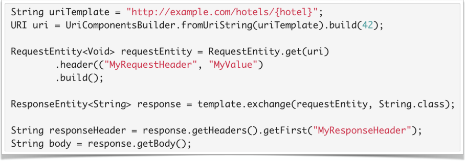
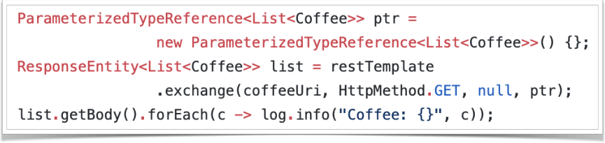
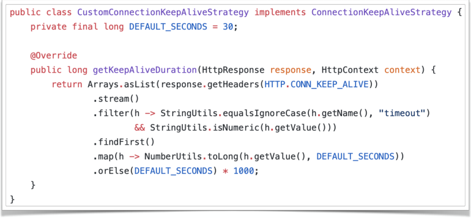

# 访问 Web 资源

[TOC]

------

## 通过 RestTemplate 访问 Web 资源

- ### Spring Boot 中的 RestTemplate

  Spring Boot 中没有自动配置 RestTemplate

  Spring Boot 提供了 RestTemplateBuilder

  RestTemplateBuilder.build()

- ### 常用方法

  - GET 请求

    - getForObject() / getForEntity()

  - POST 请求

    - postForObject() / postForEntity()

  - PUT 请求

    - put()

  - DELETE 请求

    - delete()

- ### 构造 URI
  
  - 构造 URI

    - UriComponentsBuilder
  
  - 构造相对于当前请求的 URI

    - ServletUriComponentsBuilder
  
  - 构造指向 Controller 的 URI

    - MvcUriComponentsBuilder

---
---

### RestTemplate 的高阶用法

- 传递 HTTP Header

  - RestTemplate.exchange()

  - RequestEntity<T> / ResponseEntity<T>

- HTTP Header

- 类型转换

  - JsonSerializer / JsonDeserializer
  - @JsonComponent

- 解析泛型对象
  - RestTemplate.exchange()

  - ParameterizedTypeReference<T>

    

  ------

  ------

### 简单定制 RestTemplate

### RestTemplate 支持的 HTTP 库

- 通⽤接口
  - ClientHttpRequestFactory

- 默认实现
  - SimpleClientHttpRequestFactory

- Apache HttpComponents
  - HttpComponentsClientHttpRequestFactory
- Netty
  - Netty4ClientHttpRequestFactory
- OkHttp
  - OkHttp3ClientHttpRequestFactory

### 优化底层请求策略

- 连接管理
  - PoolingHttpClientConnectionManager
  - KeepAlive 策略
- 超时设置
  
  - connectTimeout / readTimeout
- SSL校验
  
- 证书检查策略
  
- 连接复⽤

  

  > - 默认实现
  >
  >   - org.apache.http.impl.client.DefaultConnectionKeepAliveStrategy
  >
  >   ------
  >
  >   ------
  >
  >   

## 通过 WebClient 访问 Web 资源

### 了解 WebClient

- WebClient
  - 一个以 Reactive ⽅式处理 HTTP 请求的⾮阻塞式的客户端

- ⽀持的底层 HTTP 库

  - Reactor Netty - ReactorClientHttpConnector

  - Jetty ReactiveStream HttpClient - JettyClientHttpConnector

### WebClient 的基本用法

- 创建 WebClient
  - WebClient.create()
  - WebClient.builder()

- 发起请求
  - get() / post() / put() / delete() / patch()

- 获得结果
  - retrieve() / exchange()

- 处理 HTTP Status
  - onStatus()

- 应答正⽂
  - bodyToMono() / bodyToFlux()

------

------

## SpringBucks 进度小结

### 本章小结

- RestTemplate 的各种⽤法
- RestTemplate 的简单定制
- WebClient 的基本⽤法

### SpringBucks 进度小结

- 增加了 customer-service
  - 通过编码方式查询咖啡
  - 通过编码方式创建订单

------

------

