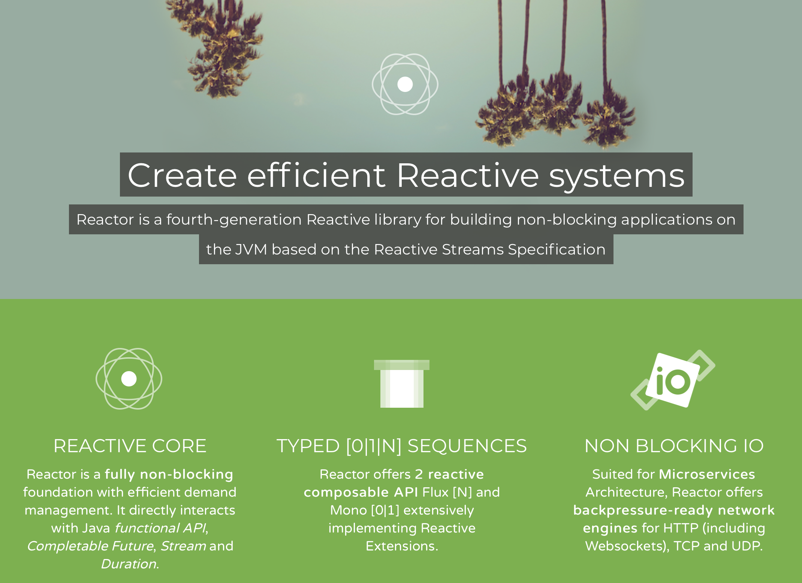
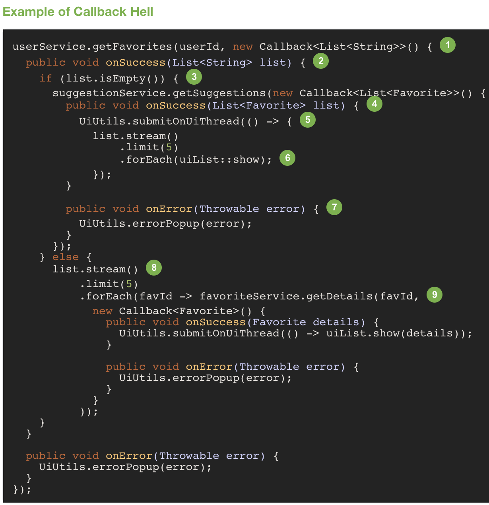
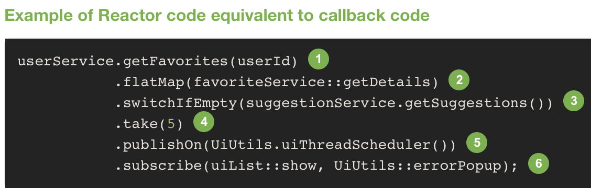
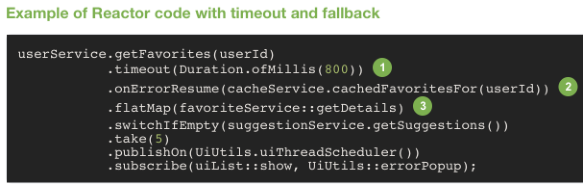

# 数据访问进阶

[TOC]


------


## Project Reactor 介绍

- 在计算机中，响应式编程或反应式编程（英语：ReactiveProgramming）是⼀种面向数据流和变化传播的编程范式。这意味着可以在编程语⾔中很⽅便地表达静态或动态的数据流，而相关的计算模型会自动将变化的值通过数据流进行传播。
  
  

- 回调式编程与响应式编程的对比

  

  

  

- 一些核⼼的概念

  - Operators - Publisher / Subscriber(生产者、订阅者)

    - Nothing Happens Until You subscribe()（在调用此操作之前，任何事情都不会发生）

    - Flux [ 0..N ] - onNext()、onComplete()、onError()（0~n的集合）

    - Mono [ 0..1 ] - onNext()、onComplete()、onError()（0~1的集合）
  
  - Backpressure（反压力）

    - Subscription()(每次请求多少个元素)

    - onRequest()、onCancel()、onDispose()

  - 线程调度 Schedulers

    
    
    线程操作
    
    - immediate()（当前是哪个线程就在当前线程做后续的订阅操作） 
    - single()（使用一个可复用线程） 
    - newSingle()（先创建一个新线程，在此线程上执行订阅的操作）
    
    
    
    线程池的操作
    
    - elastic()（缓存的线程池，线程池中每个线程60s后会被回收） 
    - parallel()  （固定线程池，创建出与CPU核数相同数量的线程，不会被回收）
    - newParallel()（新建一个固定线程池）
    
    
    
  - 错误处理
  
    - onError（相当于try catch）
  - onErrorReturn（发生异常时返回一个特定值）
    -  onErrorResume（发生异常时去消费，做一个特定代码的处理）
    - doOnError 
    - doFinally（无论正常还是异常，都会做一定的操作！）

------

1. 首先不使用线程池和其他设置

   - 代码

     

   ```java
   @Slf4j
   @SpringBootApplication
   public class SimpleReactorDemoApplication implements ApplicationRunner {
   
       public static void main(String[] args) {
           SpringApplication.run(SimpleReactorDemoApplication.class, args);
       }
   
       @Override
       public void run(ApplicationArguments args) throws Exception {
           Flux.range(1, 6)
                   .doOnRequest(n -> log.info("Request {} number", n)) // 注意顺序造成的区别
                   //.publishOn(Schedulers.elastic())
                   .doOnComplete(() -> log.info("Publisher COMPLETE 1"))
                   .map(i -> {
                       log.info("Publish {}, {}", Thread.currentThread(), i);
                       //return 10 / (i - 3);
                       return i;
                   })
                   .doOnComplete(() -> log.info("Publisher COMPLETE 2"))
                   //.subscribeOn(Schedulers.single())
   //                .onErrorResume(e -> {
   //                    log.error("Exception {}", e.toString());
   //                    return Mono.just(-1);
   //                })
                   //.onErrorReturn(-1)
                   .subscribe(i -> log.info("Subscribe {}: {}", Thread.currentThread(), i),
                           e -> log.error("error {}", e.toString()),
                           () -> log.info("Subscriber COMPLETE")//,
                           //s -> s.request(6)
                   );
           Thread.sleep(2000);
       }
   }
   ```

   - 结果

     

   ```yaml
   2020-03-15 17:04:11.353  INFO 32191 --- [           main] c.s.s.SimpleReactorDemoApplication       : Started SimpleReactorDemoApplication in 15.976 seconds (JVM running for 21.925)
   2020-03-15 17:04:11.377  INFO 32191 --- [           main] c.s.s.SimpleReactorDemoApplication       : Request 9223372036854775807 number
   2020-03-15 17:04:11.378  INFO 32191 --- [           main] c.s.s.SimpleReactorDemoApplication       : Publish Thread[main,5,main], 1
   2020-03-15 17:04:11.378  INFO 32191 --- [           main] c.s.s.SimpleReactorDemoApplication       : Subscribe Thread[main,5,main]: 1
   2020-03-15 17:04:11.378  INFO 32191 --- [           main] c.s.s.SimpleReactorDemoApplication       : Publish Thread[main,5,main], 2
   2020-03-15 17:04:11.378  INFO 32191 --- [           main] c.s.s.SimpleReactorDemoApplication       : Subscribe Thread[main,5,main]: 2
   2020-03-15 17:04:11.379  INFO 32191 --- [           main] c.s.s.SimpleReactorDemoApplication       : Publish Thread[main,5,main], 3
   2020-03-15 17:04:11.379  INFO 32191 --- [           main] c.s.s.SimpleReactorDemoApplication       : Subscribe Thread[main,5,main]: 3
   2020-03-15 17:04:11.379  INFO 32191 --- [           main] c.s.s.SimpleReactorDemoApplication       : Publish Thread[main,5,main], 4
   2020-03-15 17:04:11.379  INFO 32191 --- [           main] c.s.s.SimpleReactorDemoApplication       : Subscribe Thread[main,5,main]: 4
   2020-03-15 17:04:11.379  INFO 32191 --- [           main] c.s.s.SimpleReactorDemoApplication       : Publish Thread[main,5,main], 5
   2020-03-15 17:04:11.379  INFO 32191 --- [           main] c.s.s.SimpleReactorDemoApplication       : Subscribe Thread[main,5,main]: 5
   2020-03-15 17:04:11.380  INFO 32191 --- [           main] c.s.s.SimpleReactorDemoApplication       : Publish Thread[main,5,main], 6
   2020-03-15 17:04:11.380  INFO 32191 --- [           main] c.s.s.SimpleReactorDemoApplication       : Subscribe Thread[main,5,main]: 6
   2020-03-15 17:04:11.380  INFO 32191 --- [           main] c.s.s.SimpleReactorDemoApplication       : Publisher COMPLETE 1
   2020-03-15 17:04:11.380  INFO 32191 --- [           main] c.s.s.SimpleReactorDemoApplication       : Publisher COMPLETE 2
   2020-03-15 17:04:11.381  INFO 32191 --- [           main] c.s.s.SimpleReactorDemoApplication       : Subscriber COMPLETE
   Disconnected from the target VM, address: '127.0.0.1:49896', transport: 'socket'
   ```

   

2. 更改publishOn线程池和subscribeOn线程池

   - 代码

     

   ```java
   @Slf4j
   @SpringBootApplication
   public class SimpleReactorDemoApplication implements ApplicationRunner {
   
       public static void main(String[] args) {
           SpringApplication.run(SimpleReactorDemoApplication.class, args);
       }
   
       @Override
       public void run(ApplicationArguments args) throws Exception {
           Flux.range(1, 6)
                   .doOnRequest(n -> log.info("Request {} number", n)) // 注意顺序造成的区别
   
                   .doOnComplete(() -> log.info("Publisher COMPLETE 1"))
                   .publishOn(Schedulers.elastic())
                   .map(i -> {
                       log.info("Publish {}, {}", Thread.currentThread(), i);
                       //return 10 / (i - 3);
                       return i;
                   })
                   .doOnComplete(() -> log.info("Publisher COMPLETE 2"))
                   .subscribeOn(Schedulers.single())
   //                .onErrorResume(e -> {
   //                    log.error("Exception {}", e.toString());
   //                    return Mono.just(-1);
   //                })
                   //.onErrorReturn(-1)
                   .subscribe(i -> log.info("Subscribe {}: {}", Thread.currentThread(), i),
                           e -> log.error("error {}", e.toString()),
                           () -> log.info("Subscriber COMPLETE")//,
                           //s -> s.request(6)
                   );
           Thread.sleep(2000);
       }
   }
   ```

   - 结果

     

   ```yaml
   2020-03-15 17:14:54.601  INFO 32299 --- [           main] c.s.s.SimpleReactorDemoApplication       : Started SimpleReactorDemoApplication in 17.449 seconds (JVM running for 23.909)
   2020-03-15 17:14:54.859  INFO 32299 --- [       single-1] c.s.s.SimpleReactorDemoApplication       : Request 256 number
   2020-03-15 17:14:54.861  INFO 32299 --- [       single-1] c.s.s.SimpleReactorDemoApplication       : Publisher COMPLETE 1
   2020-03-15 17:14:54.861  INFO 32299 --- [      elastic-2] c.s.s.SimpleReactorDemoApplication       : Publish Thread[elastic-2,5,main], 1
   2020-03-15 17:14:54.861  INFO 32299 --- [      elastic-2] c.s.s.SimpleReactorDemoApplication       : Subscribe Thread[elastic-2,5,main]: 1
   2020-03-15 17:14:54.861  INFO 32299 --- [      elastic-2] c.s.s.SimpleReactorDemoApplication       : Publish Thread[elastic-2,5,main], 2
   2020-03-15 17:14:54.861  INFO 32299 --- [      elastic-2] c.s.s.SimpleReactorDemoApplication       : Subscribe Thread[elastic-2,5,main]: 2
   2020-03-15 17:14:54.862  INFO 32299 --- [      elastic-2] c.s.s.SimpleReactorDemoApplication       : Publish Thread[elastic-2,5,main], 3
   2020-03-15 17:14:54.862  INFO 32299 --- [      elastic-2] c.s.s.SimpleReactorDemoApplication       : Subscribe Thread[elastic-2,5,main]: 3
   2020-03-15 17:14:54.862  INFO 32299 --- [      elastic-2] c.s.s.SimpleReactorDemoApplication       : Publish Thread[elastic-2,5,main], 4
   2020-03-15 17:14:54.862  INFO 32299 --- [      elastic-2] c.s.s.SimpleReactorDemoApplication       : Subscribe Thread[elastic-2,5,main]: 4
   2020-03-15 17:14:54.862  INFO 32299 --- [      elastic-2] c.s.s.SimpleReactorDemoApplication       : Publish Thread[elastic-2,5,main], 5
   2020-03-15 17:14:54.862  INFO 32299 --- [      elastic-2] c.s.s.SimpleReactorDemoApplication       : Subscribe Thread[elastic-2,5,main]: 5
   2020-03-15 17:14:54.862  INFO 32299 --- [      elastic-2] c.s.s.SimpleReactorDemoApplication       : Publish Thread[elastic-2,5,main], 6
   2020-03-15 17:14:54.862  INFO 32299 --- [      elastic-2] c.s.s.SimpleReactorDemoApplication       : Subscribe Thread[elastic-2,5,main]: 6
   2020-03-15 17:14:54.862  INFO 32299 --- [      elastic-2] c.s.s.SimpleReactorDemoApplication       : Publisher COMPLETE 2
   2020-03-15 17:14:54.862  INFO 32299 --- [      elastic-2] c.s.s.SimpleReactorDemoApplication       : Subscriber COMPLETE
   ```

   

3. 添加异常错误处理

   - 代码

     

   ```java
   @Override
       public void run(ApplicationArguments args) throws Exception {
           Flux.range(1, 6)
                   .doOnRequest(n -> log.info("Request {} number", n)) // 注意顺序造成的区别
   
                   .doOnComplete(() -> log.info("Publisher COMPLETE 1"))
                   .publishOn(Schedulers.elastic())
                   .map(i -> {
                       log.info("Publish {}, {}", Thread.currentThread(), i);
                       return 10 / (i - 3);
                       //return i;
                   })
                   .doOnComplete(() -> log.info("Publisher COMPLETE 2"))
                   .subscribeOn(Schedulers.single())
                   .onErrorResume(e -> {
                       log.error("Exception {}", e.toString());
                       return Mono.just(-1);
                   })
                   .onErrorReturn(-1)
                   .subscribe(i -> log.info("Subscribe {}: {}", Thread.currentThread(), i),
                           e -> log.error("error {}", e.toString()),
                           () -> log.info("Subscriber COMPLETE")//,
                           //s -> s.request(6)
                   );
           Thread.sleep(2000);
       }
   ```

   - 结果

     

   ```yaml
   2020-03-15 17:25:06.245  INFO 32377 --- [           main] c.s.s.SimpleReactorDemoApplication       : Started SimpleReactorDemoApplication in 16.632 seconds (JVM running for 22.928)
   2020-03-15 17:25:06.343  INFO 32377 --- [       single-1] c.s.s.SimpleReactorDemoApplication       : Request 256 number
   2020-03-15 17:25:06.347  INFO 32377 --- [       single-1] c.s.s.SimpleReactorDemoApplication       : Publisher COMPLETE 1
   2020-03-15 17:25:06.347  INFO 32377 --- [      elastic-2] c.s.s.SimpleReactorDemoApplication       : Publish Thread[elastic-2,5,main], 1
   2020-03-15 17:25:06.348  INFO 32377 --- [      elastic-2] c.s.s.SimpleReactorDemoApplication       : Subscribe Thread[elastic-2,5,main]: -5
   2020-03-15 17:25:06.348  INFO 32377 --- [      elastic-2] c.s.s.SimpleReactorDemoApplication       : Publish Thread[elastic-2,5,main], 2
   2020-03-15 17:25:06.348  INFO 32377 --- [      elastic-2] c.s.s.SimpleReactorDemoApplication       : Subscribe Thread[elastic-2,5,main]: -10
   2020-03-15 17:25:06.348  INFO 32377 --- [      elastic-2] c.s.s.SimpleReactorDemoApplication       : Publish Thread[elastic-2,5,main], 3
   2020-03-15 17:25:06.354 ERROR 32377 --- [      elastic-2] c.s.s.SimpleReactorDemoApplication       : Exception java.lang.ArithmeticException: / by zero
   2020-03-15 17:25:06.372  INFO 32377 --- [      elastic-2] c.s.s.SimpleReactorDemoApplication       : Subscribe Thread[elastic-2,5,main]: -1
   2020-03-15 17:25:06.372  INFO 32377 --- [      elastic-2] c.s.s.SimpleReactorDemoApplication       : Subscriber COMPLETE
   
   ```

   

4. 更改每次请求的数目,增加反压力测试

   - 代码

     
   
   ```java
   @Override
       public void run(ApplicationArguments args) throws Exception {
           Flux.range(1, 6)
                   .publishOn(Schedulers.elastic())
                   .doOnRequest(n -> log.info("Request {} number", n)) // 注意顺序造成的区别
                   .doOnComplete(() -> log.info("Publisher COMPLETE 1"))
                   .map(i -> {
                       log.info("Publish {}, {}", Thread.currentThread(), i);
   //                    return 10 / (i - 3);
                       return i;
                   })
                   .doOnComplete(() -> log.info("Publisher COMPLETE 2"))
                   .subscribeOn(Schedulers.single())
                   .onErrorResume(e -> {
                       log.error("Exception {}", e.toString());
                       return Mono.just(-1);
                   })
                   .onErrorReturn(-1)
                   .subscribe(i -> log.info("Subscribe {}: {}", Thread.currentThread(), i),
                           e -> log.error("error {}", e.toString()),
                           () -> log.info("Subscriber COMPLETE"),
                           s -> s.request(4)
                   );
           Thread.sleep(2000);
    }
   ```

   - 结果
   
     
   
   ```yaml
   2020-03-15 17:29:12.265  INFO 32410 --- [           main] c.s.s.SimpleReactorDemoApplication       : Started SimpleReactorDemoApplication in 16.278 seconds (JVM running for 22.414)
   2020-03-15 17:29:12.315  INFO 32410 --- [       single-1] c.s.s.SimpleReactorDemoApplication       : Request 4 number
   2020-03-15 17:29:12.317  INFO 32410 --- [      elastic-2] c.s.s.SimpleReactorDemoApplication       : Publish Thread[elastic-2,5,main], 1
   2020-03-15 17:29:12.317  INFO 32410 --- [      elastic-2] c.s.s.SimpleReactorDemoApplication       : Subscribe Thread[elastic-2,5,main]: 1
   2020-03-15 17:29:12.318  INFO 32410 --- [      elastic-2] c.s.s.SimpleReactorDemoApplication       : Publish Thread[elastic-2,5,main], 2
   2020-03-15 17:29:12.318  INFO 32410 --- [      elastic-2] c.s.s.SimpleReactorDemoApplication       : Subscribe Thread[elastic-2,5,main]: 2
   2020-03-15 17:29:12.318  INFO 32410 --- [      elastic-2] c.s.s.SimpleReactorDemoApplication       : Publish Thread[elastic-2,5,main], 3
   2020-03-15 17:29:12.318  INFO 32410 --- [      elastic-2] c.s.s.SimpleReactorDemoApplication       : Subscribe Thread[elastic-2,5,main]: 3
   2020-03-15 17:29:12.318  INFO 32410 --- [      elastic-2] c.s.s.SimpleReactorDemoApplication       : Publish Thread[elastic-2,5,main], 4
   2020-03-15 17:29:12.318  INFO 32410 --- [      elastic-2] c.s.s.SimpleReactorDemoApplication       : Subscribe Thread[elastic-2,5,main]: 4
   ```

------


## 通过 Reactive 的⽅式访问数据-Redis

- Spring Data Redis

  - Lettuce 能够支持 Reactive 方式
  
  - Spring Data Redis 中主要的支持

    - ReactiveRedisConnection

    - ReactiveRedisConnectionFactory

    - ReactiveRedisTemplate

      - opsForXxx()

---
- 代码示例

  

```java
@Slf4j
@SpringBootApplication
public class RedisReactorDemoApplication implements ApplicationRunner {

    public static final String KEY = "COFFEE_MENU";

    @Autowired
    private JdbcTemplate jdbcTemplate;

    @Autowired
    private ReactiveStringRedisTemplate reactiveStringRedisTemplate;

    public static void main(String[] args) {
        SpringApplication.run(RedisReactorDemoApplication.class, args);
    }

    @Bean
    ReactiveRedisTemplate reactiveRedisTemplate(ReactiveRedisConnectionFactory factory) {
        return new ReactiveStringRedisTemplate(factory);
    }

    @Override
    public void run(ApplicationArguments args) throws Exception {

        ReactiveHashOperations<String, String, String> opsForHash = reactiveStringRedisTemplate.opsForHash();

        CountDownLatch cdl = new CountDownLatch(1);

        List<Coffee> lsit = jdbcTemplate.query(
                "select * from t_coffee", (rs, i) ->
                        Coffee.builder().
                                id(rs.getLong("id"))
                                .name(rs.getString("name"))
                                .price(rs.getLong("price"))
                                .build()
        );

        Flux.fromIterable(lsit)
                .publishOn(Schedulers.single())
                .doOnComplete(()->log.info("list ok"))
                .flatMap(c->{
                    log.info("try to put {} {}",c.getName(),c.getPrice());
                    return opsForHash.put(KEY,c.getName(),c.getPrice().toString());
                })
                .doOnComplete(()->log.info("set ok"))
                .concatWith(reactiveStringRedisTemplate.expire(KEY, Duration.ofMinutes(1)))
                .doOnComplete(()->log.info("set ok"))
                .onErrorResume(e->{
                    log.error("exception {}",e.getMessage());
                    return Mono.just(false);
                })
                .subscribe(aBoolean -> log.info("Boolean:{}",aBoolean),
                        e-> log.error("Exception {}",e.getMessage()),
                        ()->cdl.countDown());
        log.info("Waiting");
        cdl.await();
    }
}
```

- 结果

  

```yaml
2020-03-15 18:12:17.554  INFO 32788 --- [           main] c.s.r.RedisReactorDemoApplication        : No active profile set, falling back to default profiles: default
2020-03-15 18:12:18.776  INFO 32788 --- [           main] .s.d.r.c.RepositoryConfigurationDelegate : Multiple Spring Data modules found, entering strict repository configuration mode!
2020-03-15 18:12:18.777  INFO 32788 --- [           main] .s.d.r.c.RepositoryConfigurationDelegate : Bootstrapping Spring Data JDBC repositories in DEFAULT mode.
2020-03-15 18:12:18.801  INFO 32788 --- [           main] .s.d.r.c.RepositoryConfigurationDelegate : Finished Spring Data repository scanning in 18ms. Found 0 JDBC repository interfaces.
2020-03-15 18:12:18.816  INFO 32788 --- [           main] .s.d.r.c.RepositoryConfigurationDelegate : Multiple Spring Data modules found, entering strict repository configuration mode!
2020-03-15 18:12:18.817  INFO 32788 --- [           main] .s.d.r.c.RepositoryConfigurationDelegate : Bootstrapping Spring Data Redis repositories in DEFAULT mode.
2020-03-15 18:12:18.831  INFO 32788 --- [           main] .s.d.r.c.RepositoryConfigurationDelegate : Finished Spring Data repository scanning in 1ms. Found 0 Redis repository interfaces.
2020-03-15 18:12:19.429  INFO 32788 --- [           main] com.zaxxer.hikari.HikariDataSource       : HikariPool-1 - Starting...
2020-03-15 18:12:19.596  INFO 32788 --- [           main] com.zaxxer.hikari.HikariDataSource       : HikariPool-1 - Start completed.
2020-03-15 18:12:24.172  INFO 32788 --- [           main] c.s.r.RedisReactorDemoApplication        : Started RedisReactorDemoApplication in 22.294 seconds (JVM running for 28.58)
2020-03-15 18:12:24.352  INFO 32788 --- [           main] c.s.r.RedisReactorDemoApplication        : Waiting
2020-03-15 18:12:24.352  INFO 32788 --- [       single-1] c.s.r.RedisReactorDemoApplication        : try to put espresso 2000
2020-03-15 18:12:24.481  INFO 32788 --- [       single-1] io.lettuce.core.EpollProvider            : Starting without optional epoll library
2020-03-15 18:12:24.482  INFO 32788 --- [       single-1] io.lettuce.core.KqueueProvider           : Starting without optional kqueue library
2020-03-15 18:12:30.221  INFO 32788 --- [       single-1] c.s.r.RedisReactorDemoApplication        : try to put latte 2500
2020-03-15 18:12:30.222  INFO 32788 --- [       single-1] c.s.r.RedisReactorDemoApplication        : try to put capuccino 2500
2020-03-15 18:12:30.222  INFO 32788 --- [       single-1] c.s.r.RedisReactorDemoApplication        : try to put mocha 3000
2020-03-15 18:12:30.223  INFO 32788 --- [       single-1] c.s.r.RedisReactorDemoApplication        : try to put macchiato 3000
2020-03-15 18:12:30.224  INFO 32788 --- [       single-1] c.s.r.RedisReactorDemoApplication        : list ok
2020-03-15 18:12:30.430  INFO 32788 --- [ioEventLoop-4-1] c.s.r.RedisReactorDemoApplication        : Boolean:true
2020-03-15 18:12:30.433  INFO 32788 --- [ioEventLoop-4-1] c.s.r.RedisReactorDemoApplication        : Boolean:true
2020-03-15 18:12:30.434  INFO 32788 --- [ioEventLoop-4-1] c.s.r.RedisReactorDemoApplication        : Boolean:true
2020-03-15 18:12:30.435  INFO 32788 --- [ioEventLoop-4-1] c.s.r.RedisReactorDemoApplication        : Boolean:true
2020-03-15 18:12:30.435  INFO 32788 --- [ioEventLoop-4-1] c.s.r.RedisReactorDemoApplication        : Boolean:true
2020-03-15 18:12:30.435  INFO 32788 --- [ioEventLoop-4-1] c.s.r.RedisReactorDemoApplication        : set ok
2020-03-15 18:12:30.535  INFO 32788 --- [ioEventLoop-4-1] c.s.r.RedisReactorDemoApplication        : Boolean:true
2020-03-15 18:12:30.535  INFO 32788 --- [ioEventLoop-4-1] c.s.r.RedisReactorDemoApplication        : set ok
2020-03-15 18:12:30.703  INFO 32788 --- [extShutdownHook] com.zaxxer.hikari.HikariDataSource       : HikariPool-1 - Shutdown initiated...
2020-03-15 18:12:30.722  INFO 32788 --- [extShutdownHook] com.zaxxer.hikari.HikariDataSource       : HikariPool-1 - Shutdown completed.
```

---

## 通过 Reactive 的方式访问数据-MongoDB

- Spring Data MongoDB
  - MongoDB 官方提供了支持 Reactive 的驱动

    - mongodb-driver-reactivestreams

  - Spring Data MongoDB 中主要的支持

    - ReactiveMongoClientFactoryBean

    - ReactiveMongoDatabaseFactory

    - ReactiveMongoTemplate

---
- 代码

  

```java
@Slf4j
@SpringBootApplication
public class ReactiveMongoDemoApplication implements ApplicationRunner {

    @Autowired
    private ReactiveMongoTemplate reactiveMongoTemplate;
    private CountDownLatch cdl =new CountDownLatch(1);

    public static void main(String[] args) {
        SpringApplication.run(ReactiveMongoDemoApplication.class, args);
    }

    @Bean
    public MongoCustomConversions mongoCustomConversions() {
        return new MongoCustomConversions(
                Arrays.asList(new MoneyReadConverter(),
                        new MoneyWriteConverter())
        );
    }
    @Override
    public void run(ApplicationArguments args) throws Exception {
        //startFormInsertion(()->log.info("Runnable"));
        startFormInsertion(()->{
            log.info("Runable");
            decreaseHighPrice();
        });
        log.info("after starting!");
        //decreaseHighPrice();
    }
    private void startFormInsertion(Runnable runnable) {
        reactiveMongoTemplate.insertAll(initCoffee())
                .publishOn(Schedulers.elastic())
                .doOnNext(c -> log.info("Next {}", c))
                .doOnComplete(runnable)
                .doFinally(s -> {
                    cdl.countDown();
                    log.info("Finally 1 {}", s);
                })
                .count()
                .subscribe(c -> log.info("insert {} records", c));
    }
    private void decreaseHighPrice() {
        reactiveMongoTemplate.updateMulti(
                query(where("price").gte(3000L)),
                new Update().inc("price", -500L)
                        .currentDate("updateTme"),
                Coffee.class
        ).doFinally(s -> {
            cdl.countDown();
            log.info("Finally 2,{}", s);
        }).subscribe(r -> log.info("Result is {}", r));
    }
    private List<Coffee> initCoffee() {
        Coffee espresso = Coffee.builder()
                .name("espresso")
                .price(Money.of(CurrencyUnit.of("CNY"), 20.0))
                .createTime(new Date())
                .updateTime(new Date())
                .build();
        Coffee lattee = Coffee.builder()
                .name("lattee")
                .price(Money.of(CurrencyUnit.of("CNY"), 30.0))
                .createTime(new Date())
                .updateTime(new Date())
                .build();
        return Arrays.asList(espresso, lattee);
    }
}
```

- 结果

```yaml
2020-03-15 19:08:40.580  INFO 33333 --- [           main] c.s.r.ReactiveMongoDemoApplication       : Started ReactiveMongoDemoApplication in 6.345 seconds (JVM running for 12.636)
2020-03-15 19:08:41.129  INFO 33333 --- [           main] c.s.r.ReactiveMongoDemoApplication       : after starting!
2020-03-15 19:08:41.262  INFO 33333 --- [       Thread-4] org.mongodb.driver.connection            : Opened connection [connectionId{localValue:3, serverValue:19}] to localhost:27017
2020-03-15 19:08:41.284  INFO 33333 --- [      elastic-2] c.s.r.ReactiveMongoDemoApplication       : Next Coffee(id=5e6e0cb92514b751fbb21b4f, name=espresso, price=CNY 20.00, createTime=Sun Mar 15 19:08:40 CST 2020, updateTime=Sun Mar 15 19:08:40 CST 2020)
2020-03-15 19:08:41.292  INFO 33333 --- [      elastic-2] c.s.r.ReactiveMongoDemoApplication       : Next Coffee(id=5e6e0cb92514b751fbb21b50, name=lattee, price=CNY 30.00, createTime=Sun Mar 15 19:08:40 CST 2020, updateTime=Sun Mar 15 19:08:40 CST 2020)
2020-03-15 19:08:41.292  INFO 33333 --- [      elastic-2] c.s.r.ReactiveMongoDemoApplication       : Runable
2020-03-15 19:08:41.349  INFO 33333 --- [      elastic-2] c.s.r.ReactiveMongoDemoApplication       : insert 2 records
2020-03-15 19:08:41.350  INFO 33333 --- [      elastic-2] c.s.r.ReactiveMongoDemoApplication       : Finally 1 onComplete
2020-03-15 19:08:41.354  INFO 33333 --- [       Thread-6] c.s.r.ReactiveMongoDemoApplication       : Result is AcknowledgedUpdateResult{matchedCount=1, modifiedCount=1, upsertedId=null}
2020-03-15 19:08:41.355  INFO 33333 --- [       Thread-6] c.s.r.ReactiveMongoDemoApplication       : Finally 2,onComplete
```

---

## 通过 Reactive 的⽅式访问数据-RDBMS

- Spring Data R2DBC
  - R2DBC （https://spring.io/projects/spring-data-r2dbc）

  - Reactive Relational Database Connectivity
- 支持的数据库

  - Postgres（io.r2dbc:r2dbc-postgresql）

  - H2（io.r2dbc:r2dbc-h2）

  - Microsoft SQL Server（io.r2dbc:r2dbc-mssql）

- 一些主要的类

  - ConnectionFactory

  - DatabaseClient

    - execute().sql(SQL)
    - inTransaction(db -> {})

  - R2dbcExceptionTranslator
    - SqlErrorCodeR2dbcExceptionTranslator

---
- 代码

```java
@Slf4j
@SpringBootApplication
public class SimpleR2dbcDemoApplication extends AbstractR2dbcConfiguration implements ApplicationRunner {

    @Autowired
    private DatabaseClient databaseClient;

    public static void main(String[] args) {
        SpringApplication.run(SimpleR2dbcDemoApplication.class, args);
    }

    @Override
    public void run(ApplicationArguments args) throws Exception {

        CountDownLatch cdl = new CountDownLatch(1);

        databaseClient.execute()
                .sql("select * from t_coffee")
                .as(Coffee.class)
                .fetch()
                .first()
                .doFinally(signalType -> cdl.countDown())
                //.subscribeOn(Schedulers.elastic())
                .subscribe(coffee -> log.info("fetch execute() {}",coffee));

        databaseClient.select()
                .from("t_coffee")
                .orderBy(Sort.by(Sort.Direction.DESC,"id"))
                .page(PageRequest.of(0,3))
                .as(Coffee.class)
                .fetch()
                .all()
                .doFinally(signalType -> cdl.countDown())
//                .subscribeOn(Schedulers.elastic())
                .subscribe(coffee -> log.info("fetch eecute() {}",coffee));

        log.info("after starting");
        cdl.await();

    }
    @Bean
    public R2dbcCustomConversions r2dbcCustomConversions(){
        Dialect dialect = getDialect(connectionFactory());
        CustomConversions.StoreConversions storeConversions =
                CustomConversions.StoreConversions.of(dialect.getSimpleTypeHolder());

        return new R2dbcCustomConversions(storeConversions,
                Arrays.asList(new MoneyReadConverter(),new MoneyWriteConverter()));
    }
    @Override
    @Bean
    public ConnectionFactory connectionFactory() {
        return new H2ConnectionFactory(
                H2ConnectionConfiguration.builder()
                        .inMemory("testdb")
                        .username("sa")
                        .build()
        );
    }
}
```

---

- R2DBC Repository ⽀持
  
  - 一些主要的类

  - @EnableR2dbcRepositories

  - ReactiveCrudRepository<T, ID>

    - @Table / @Id

    - 其中的⽅法返回都是 Mono 或者 Flux

    - ⾃自定义查询需要自⼰写 @Query

---
- 代码

  
  
  ```java
  @Slf4j
  @SpringBootApplication
  @EnableR2dbcRepositories
  public class R2dbcRepositoryDemoApplication extends AbstractR2dbcConfiguration implements ApplicationRunner {
  
      @Autowired
      private CoffeeRepository repository;
  
      public static void main(String[] args) {
          SpringApplication.run(R2dbcRepositoryDemoApplication.class, args);
      }
  
      @Override
      public void run(ApplicationArguments args) throws Exception {
  
          CountDownLatch cdl = new CountDownLatch(2);
  
          repository.findAllById(Flux.just(1L, 2L))
                  .map(c -> c.getName() + "-" + c.getPrice().toString())
                  .doFinally(s -> cdl.countDown())
                  .subscribe(c -> log.info("Find {}", c));
  
          repository.findByName("mocha")
                  .doFinally(s -> cdl.countDown())
                  .subscribe(c -> log.info("Find {}", c));
  
          cdl.await();
      }
  
      @Bean
      public ConnectionFactory connectionFactory() {
          return new H2ConnectionFactory(
                  H2ConnectionConfiguration.builder()
                          .inMemory("testdb")
                          .username("sa")
                          .build());
      }
  
      @Bean
      public R2dbcCustomConversions r2dbcCustomConversions() {
          Dialect dialect = getDialect(connectionFactory());
          CustomConversions.StoreConversions storeConversions =
                  CustomConversions.StoreConversions.of(dialect.getSimpleTypeHolder());
          return new R2dbcCustomConversions(storeConversions,
                  Arrays.asList(new MoneyReadConverter(), new MoneyWriteConverter()));
      }
  }
  ```

---

## 通过 AOP 打印数据访问层摘要

- Spring AOP 的⼀些核心概念

    概念|含义
    ---|---
    Aspect |切面
    Join Point |连接点，Spring AOP里总是代表一次方法执行
    Advice |通知，在连接点执行的动作
    Pointcut |切入点，说明如何匹配连接点
    Introduction |引入，为现有类型声明额外的方法和属性
    Target object |目标对象
    AOP proxy AOP |代理对象，可以是 JDK 动态代理，也可以是 CGLIB 代理
    Weaving| 织入，连接切面与目标对象或类型创建代理的过程

- 常用注解

  - @EnableAspectJAutoProxy
- @Aspect
  
  - @Pointcut
- @Before
  
  - @After / @AfterReturning / @AfterThrowing
- @Around
  
- @Order
  
- 如何打印 SQL

    - HikariCP

      - P6SQL，https://github.com/p6spy/p6spy

    - Alibaba Druid

      - 内置 SQL 输出

      - https://github.com/alibaba/druid/wiki/Druid 中使用log4j2进⾏日志输出

---
- 代码

  - Application.java

    

  ```java
  @Slf4j
  @EnableTransactionManagement
  @EnableJpaRepositories
  @EnableAspectJAutoProxy
  @SpringBootApplication
  public class PerformenceAspectDemoApplication implements ApplicationRunner {
  
      @Autowired
      private CoffeeRepository coffeeRepository;
      @Autowired
      private CoffeeService coffeeService;
      @Autowired
      private CoffeeOrderService orderService;
  
      public static void main(String[] args) {
          SpringApplication.run(PerformenceAspectDemoApplication.class, args);
      }
  
      @Override
      public void run(ApplicationArguments args) throws Exception {
  
          log.info("All Coffee: {}", coffeeRepository.findAll());
  
          Optional<Coffee> latte = coffeeService.findOneCoffee("Latte");
          if (latte.isPresent()) {
              CoffeeOrder order = orderService.createOrder("Li Lei", latte.get());
              log.info("Update INIT to PAID: {}", orderService.updateState(order, OrderState.PAID));
              log.info("Update PAID to INIT: {}", orderService.updateState(order, OrderState.INIT));
          }
      }
  }
  ```

  - PerformanceAspect.java

    

  ```java
  @Aspect
  @Component
  @Slf4j
  public class PerformanceAspect {
  
      @Around("repositoryOps()")
      public Object logPerformance(ProceedingJoinPoint proceedingJoinPoint) throws Throwable {
  
          long startTime = System.currentTimeMillis();
          String name = "-";
          String result = "Y";
  
          try {
              name = proceedingJoinPoint.getSignature().toShortString();
              return proceedingJoinPoint.proceed();
          } catch (Throwable throwable) {
              result = "N";
              throw throwable;
          } finally {
              long endTime = System.currentTimeMillis();
              log.info("{};{};{}ms", name, result, endTime - startTime);
          }
  
      }
  
      @Pointcut("execution(* com.simon.performenceaspectdemo.repository..*(..))")
      private void repositoryOps() {
  
      }
  }
  ```

  

- 运行效果

  
  
  ```
  2020-03-15 20:59:44.464  INFO 34296 --- [           main] c.s.p.PerformenceAspectDemoApplication   : No active profile set, falling back to default profiles: default
  2020-03-15 20:59:46.016  INFO 34296 --- [           main] .s.d.r.c.RepositoryConfigurationDelegate : Bootstrapping Spring Data JPA repositories in DEFAULT mode.
  2020-03-15 20:59:46.168  INFO 34296 --- [           main] .s.d.r.c.RepositoryConfigurationDelegate : Finished Spring Data repository scanning in 119ms. Found 2 JPA repository interfaces.
  2020-03-15 20:59:47.686  INFO 34296 --- [           main] com.zaxxer.hikari.HikariDataSource       : HikariPool-1 - Starting...
  2020-03-15 20:59:47.947  INFO 34296 --- [           main] com.zaxxer.hikari.HikariDataSource       : HikariPool-1 - Start completed.
  2020-03-15 20:59:47.976  INFO 34296 --- [           main] p6spy                                    : 1584277187976|3|statement|connection 0|url jdbc:p6spy:h2:mem:testdb|drop table t_coffee if exists|drop table t_coffee if exists
  2020-03-15 20:59:47.977  INFO 34296 --- [           main] p6spy                                    : 1584277187977|0|statement|connection 0|url jdbc:p6spy:h2:mem:testdb|drop table t_order if exists|drop table t_order if exists
  2020-03-15 20:59:47.978  INFO 34296 --- [           main] p6spy                                    : 1584277187977|0|statement|connection 0|url jdbc:p6spy:h2:mem:testdb|drop table t_order_coffee if exists|drop table t_order_coffee if exists
  2020-03-15 20:59:47.998  INFO 34296 --- [           main] p6spy                                    : 1584277187998|20|statement|connection 0|url jdbc:p6spy:h2:mem:testdb|create table t_coffee ( id bigint auto_increment, create_time timestamp, update_time timestamp, name varchar(255), price bigint, primary key (id) )|create table t_coffee ( id bigint auto_increment, create_time timestamp, update_time timestamp, name varchar(255), price bigint, primary key (id) )
  2020-03-15 20:59:48.001  INFO 34296 --- [           main] p6spy                                    : 1584277188000|1|statement|connection 0|url jdbc:p6spy:h2:mem:testdb|create table t_order ( id bigint auto_increment, create_time timestamp, update_time timestamp, customer varchar(255), state integer not null, primary key (id) )|create table t_order ( id bigint auto_increment, create_time timestamp, update_time timestamp, customer varchar(255), state integer not null, primary key (id) )
  2020-03-15 20:59:48.002  INFO 34296 --- [           main] p6spy                                    : 1584277188002|0|statement|connection 0|url jdbc:p6spy:h2:mem:testdb|create table t_order_coffee ( coffee_order_id bigint not null, items_id bigint not null )|create table t_order_coffee ( coffee_order_id bigint not null, items_id bigint not null )
  2020-03-15 20:59:48.108  INFO 34296 --- [           main] p6spy                                    : 1584277188108|19|statement|connection 0|url jdbc:p6spy:h2:mem:testdb|insert into t_coffee (name, price, create_time, update_time) values ('espresso', 2000, now(), now())|insert into t_coffee (name, price, create_time, update_time) values ('espresso', 2000, now(), now())
  2020-03-15 20:59:48.109  INFO 34296 --- [           main] p6spy                                    : 1584277188109|0|statement|connection 0|url jdbc:p6spy:h2:mem:testdb|insert into t_coffee (name, price, create_time, update_time) values ('latte', 2500, now(), now())|insert into t_coffee (name, price, create_time, update_time) values ('latte', 2500, now(), now())
  2020-03-15 20:59:48.110  INFO 34296 --- [           main] p6spy                                    : 1584277188110|0|statement|connection 0|url jdbc:p6spy:h2:mem:testdb|insert into t_coffee (name, price, create_time, update_time) values ('capuccino', 2500, now(), now())|insert into t_coffee (name, price, create_time, update_time) values ('capuccino', 2500, now(), now())
  2020-03-15 20:59:48.111  INFO 34296 --- [           main] p6spy                                    : 1584277188111|0|statement|connection 0|url jdbc:p6spy:h2:mem:testdb|insert into t_coffee (name, price, create_time, update_time) values ('mocha', 3000, now(), now())|insert into t_coffee (name, price, create_time, update_time) values ('mocha', 3000, now(), now())
  2020-03-15 20:59:48.112  INFO 34296 --- [           main] p6spy                                    : 1584277188112|0|statement|connection 0|url jdbc:p6spy:h2:mem:testdb|insert into t_coffee (name, price, create_time, update_time) values ('macchiato', 3000, now(), now())|insert into t_coffee (name, price, create_time, update_time) values ('macchiato', 3000, now(), now())
  2020-03-15 20:59:48.483  INFO 34296 --- [           main] o.hibernate.jpa.internal.util.LogHelper  : HHH000204: Processing PersistenceUnitInfo [name: default]
  2020-03-15 20:59:48.718  INFO 34296 --- [           main] org.hibernate.Version                    : HHH000412: Hibernate ORM core version 5.4.12.Final
  2020-03-15 20:59:49.160  INFO 34296 --- [           main] o.hibernate.annotations.common.Version   : HCANN000001: Hibernate Commons Annotations {5.1.0.Final}
  2020-03-15 20:59:49.346  INFO 34296 --- [           main] org.hibernate.dialect.Dialect            : HHH000400: Using dialect: org.hibernate.dialect.H2Dialect
  2020-03-15 20:59:49.468  INFO 34296 --- [           main] p6spy                                    : 1584277189468|3|statement|connection 0|url jdbc:p6spy:h2:mem:testdb|select * from INFORMATION_SCHEMA.SEQUENCES|select * from INFORMATION_SCHEMA.SEQUENCES
  2020-03-15 20:59:50.630  INFO 34296 --- [           main] o.h.e.t.j.p.i.JtaPlatformInitiator       : HHH000490: Using JtaPlatform implementation: [org.hibernate.engine.transaction.jta.platform.internal.NoJtaPlatform]
  2020-03-15 20:59:50.639  INFO 34296 --- [           main] j.LocalContainerEntityManagerFactoryBean : Initialized JPA EntityManagerFactory for persistence unit 'default'
  2020-03-15 20:59:52.431  INFO 34296 --- [           main] c.s.p.PerformenceAspectDemoApplication   : Started PerformenceAspectDemoApplication in 9.077 seconds (JVM running for 17.238)
  2020-03-15 20:59:52.611  INFO 34296 --- [           main] p6spy                                    : 1584277192611|0|statement|connection 0|url jdbc:p6spy:h2:mem:testdb|select coffee0_.id as id1_0_, coffee0_.create_time as create_t2_0_, coffee0_.update_time as update_t3_0_, coffee0_.name as name4_0_, coffee0_.price as price5_0_ from t_coffee coffee0_|select coffee0_.id as id1_0_, coffee0_.create_time as create_t2_0_, coffee0_.update_time as update_t3_0_, coffee0_.name as name4_0_, coffee0_.price as price5_0_ from t_coffee coffee0_
  2020-03-15 20:59:52.675  INFO 34296 --- [           main] p6spy                                    : 1584277192675|15|commit|connection 0|url jdbc:p6spy:h2:mem:testdb||
  2020-03-15 20:59:52.677  INFO 34296 --- [           main] c.s.p.PerformenceAspectDemoApplication   : All Coffee: [Coffee(super=BaseEntity(id=1, createTime=2020-03-15 20:59:48.094266, updateTime=2020-03-15 20:59:48.094266), name=espresso, price=CNY 20.00), Coffee(super=BaseEntity(id=2, createTime=2020-03-15 20:59:48.109434, updateTime=2020-03-15 20:59:48.109434), name=latte, price=CNY 25.00), Coffee(super=BaseEntity(id=3, createTime=2020-03-15 20:59:48.110234, updateTime=2020-03-15 20:59:48.110234), name=capuccino, price=CNY 25.00), Coffee(super=BaseEntity(id=4, createTime=2020-03-15 20:59:48.111072, updateTime=2020-03-15 20:59:48.111072), name=mocha, price=CNY 30.00), Coffee(super=BaseEntity(id=5, createTime=2020-03-15 20:59:48.111949, updateTime=2020-03-15 20:59:48.111949), name=macchiato, price=CNY 30.00)]
  2020-03-15 20:59:52.779  INFO 34296 --- [           main] p6spy                                    : 1584277192779|0|statement|connection 0|url jdbc:p6spy:h2:mem:testdb|select coffee0_.id as id1_0_, coffee0_.create_time as create_t2_0_, coffee0_.update_time as update_t3_0_, coffee0_.name as name4_0_, coffee0_.price as price5_0_ from t_coffee coffee0_ where lower(coffee0_.name)=?|select coffee0_.id as id1_0_, coffee0_.create_time as create_t2_0_, coffee0_.update_time as update_t3_0_, coffee0_.name as name4_0_, coffee0_.price as price5_0_ from t_coffee coffee0_ where lower(coffee0_.name)='latte'
  2020-03-15 20:59:52.780  INFO 34296 --- [           main] p6spy                                    : 1584277192780|0|commit|connection 0|url jdbc:p6spy:h2:mem:testdb||
  2020-03-15 20:59:52.781  INFO 34296 --- [           main] c.s.p.aspect.PerformanceAspect           : QueryByExampleExecutor.findOne(..);Y;29ms
  2020-03-15 20:59:52.781  INFO 34296 --- [           main] c.s.p.service.CoffeeService              : Coffee Found: Optional[Coffee(super=BaseEntity(id=2, createTime=2020-03-15 20:59:48.109434, updateTime=2020-03-15 20:59:48.109434), name=latte, price=CNY 25.00)]
  2020-03-15 20:59:52.861  INFO 34296 --- [           main] p6spy                                    : 1584277192861|1|statement|connection 0|url jdbc:p6spy:h2:mem:testdb|insert into t_order (id, create_time, update_time, customer, state) values (null, ?, ?, ?, ?)|insert into t_order (id, create_time, update_time, customer, state) values (null, '2020-03-15T20:59:52.857+0800', '2020-03-15T20:59:52.857+0800', 'Li Lei', 0)
  2020-03-15 20:59:52.873  INFO 34296 --- [           main] c.s.p.aspect.PerformanceAspect           : CrudRepository.save(..);Y;42ms
  2020-03-15 20:59:52.873  INFO 34296 --- [           main] c.s.p.service.CoffeeOrderService         : New Order: CoffeeOrder(super=BaseEntity(id=1, createTime=Sun Mar 15 20:59:52 CST 2020, updateTime=Sun Mar 15 20:59:52 CST 2020), customer=Li Lei, items=[Coffee(super=BaseEntity(id=2, createTime=2020-03-15 20:59:48.109434, updateTime=2020-03-15 20:59:48.109434), name=latte, price=CNY 25.00)], state=INIT)
  2020-03-15 20:59:52.888  INFO 34296 --- [           main] p6spy                                    : 1584277192888|0|statement|connection 0|url jdbc:p6spy:h2:mem:testdb|insert into t_order_coffee (coffee_order_id, items_id) values (?, ?)|insert into t_order_coffee (coffee_order_id, items_id) values (1, 2)
  2020-03-15 20:59:52.892  INFO 34296 --- [           main] p6spy                                    : 1584277192892|0|commit|connection 0|url jdbc:p6spy:h2:mem:testdb||
  2020-03-15 20:59:52.946  INFO 34296 --- [           main] p6spy                                    : 1584277192946|0|statement|connection 0|url jdbc:p6spy:h2:mem:testdb|select coffeeorde0_.id as id1_1_0_, coffeeorde0_.create_time as create_t2_1_0_, coffeeorde0_.update_time as update_t3_1_0_, coffeeorde0_.customer as customer4_1_0_, coffeeorde0_.state as state5_1_0_ from t_order coffeeorde0_ where coffeeorde0_.id=?|select coffeeorde0_.id as id1_1_0_, coffeeorde0_.create_time as create_t2_1_0_, coffeeorde0_.update_time as update_t3_1_0_, coffeeorde0_.customer as customer4_1_0_, coffeeorde0_.state as state5_1_0_ from t_order coffeeorde0_ where coffeeorde0_.id=1
  2020-03-15 20:59:52.960  INFO 34296 --- [           main] p6spy                                    : 1584277192959|0|statement|connection 0|url jdbc:p6spy:h2:mem:testdb|select items0_.coffee_order_id as coffee_o1_2_0_, items0_.items_id as items_id2_2_0_, coffee1_.id as id1_0_1_, coffee1_.create_time as create_t2_0_1_, coffee1_.update_time as update_t3_0_1_, coffee1_.name as name4_0_1_, coffee1_.price as price5_0_1_ from t_order_coffee items0_ inner join t_coffee coffee1_ on items0_.items_id=coffee1_.id where items0_.coffee_order_id=? order by coffee1_.id|select items0_.coffee_order_id as coffee_o1_2_0_, items0_.items_id as items_id2_2_0_, coffee1_.id as id1_0_1_, coffee1_.create_time as create_t2_0_1_, coffee1_.update_time as update_t3_0_1_, coffee1_.name as name4_0_1_, coffee1_.price as price5_0_1_ from t_order_coffee items0_ inner join t_coffee coffee1_ on items0_.items_id=coffee1_.id where items0_.coffee_order_id=1 order by coffee1_.id
  2020-03-15 20:59:53.075  INFO 34296 --- [           main] c.s.p.aspect.PerformanceAspect           : CrudRepository.save(..);Y;181ms
  2020-03-15 20:59:53.075  INFO 34296 --- [           main] c.s.p.service.CoffeeOrderService         : Updated Order: CoffeeOrder(super=BaseEntity(id=1, createTime=Sun Mar 15 20:59:52 CST 2020, updateTime=Sun Mar 15 20:59:52 CST 2020), customer=Li Lei, items=[Coffee(super=BaseEntity(id=2, createTime=2020-03-15 20:59:48.109434, updateTime=2020-03-15 20:59:48.109434), name=latte, price=CNY 25.00)], state=PAID)
  2020-03-15 20:59:53.110  INFO 34296 --- [           main] p6spy                                    : 1584277193110|1|statement|connection 0|url jdbc:p6spy:h2:mem:testdb|update t_order set update_time=?, customer=?, state=? where id=?|update t_order set update_time='2020-03-15T20:59:53.076+0800', customer='Li Lei', state=1 where id=1
  2020-03-15 20:59:53.112  INFO 34296 --- [           main] p6spy                                    : 1584277193111|0|commit|connection 0|url jdbc:p6spy:h2:mem:testdb||
  2020-03-15 20:59:53.112  INFO 34296 --- [           main] c.s.p.PerformenceAspectDemoApplication   : Update INIT to PAID: true
  2020-03-15 20:59:53.112  WARN 34296 --- [           main] c.s.p.service.CoffeeOrderService         : Wrong State order: INIT, PAID
  2020-03-15 20:59:53.113  INFO 34296 --- [           main] p6spy                                    : 1584277193113|0|commit|connection 0|url jdbc:p6spy:h2:mem:testdb||
  2020-03-15 20:59:53.113  INFO 34296 --- [           main] c.s.p.PerformenceAspectDemoApplication   : Update PAID to INIT: false
  2020-03-15 20:59:53.120  INFO 34296 --- [extShutdownHook] j.LocalContainerEntityManagerFactoryBean : Closing JPA EntityManagerFactory for persistence unit 'default'
  2020-03-15 20:59:53.123  INFO 34296 --- [extShutdownHook] com.zaxxer.hikari.HikariDataSource       : HikariPool-1 - Shutdown initiated...
2020-03-15 20:59:53.127  INFO 34296 --- [extShutdownHook] com.zaxxer.hikari.HikariDataSource       : HikariPool-1 - Shutdown completed.
  ```
  
  

---

## SpringBucks 进度小结

- 本章小结

  - Project Reactor 的基本用法

  - 如何通过 Reactive 的方式访问 NoSQL

  - 如何通过 Reactive 的方式访问 RDBMS

  - Spring AOP 的基本概念

  - 监控 DAO 层的简单方案

- SpringBucks 进度小结

  - 通过 Reactive 的方式来保存数据与操作缓存

---