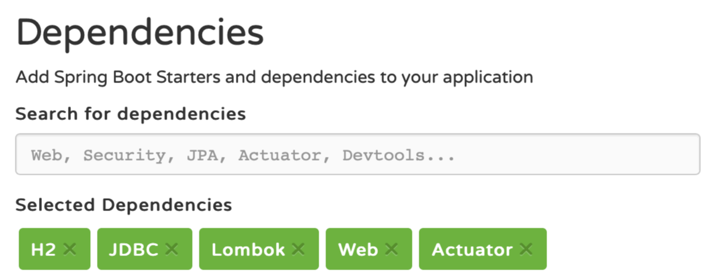
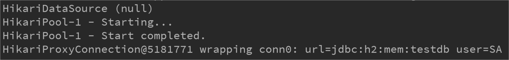
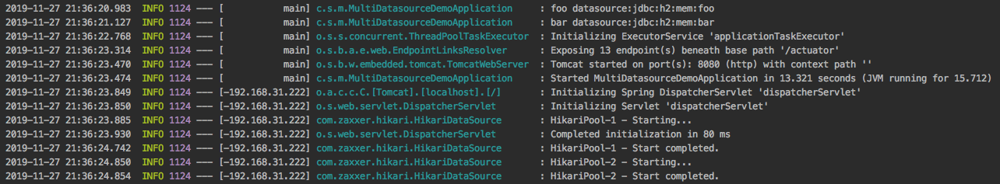
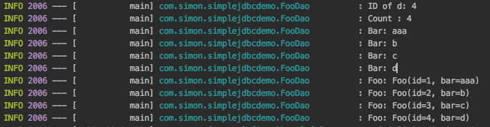
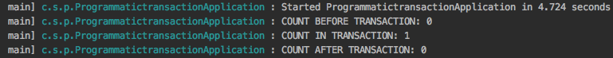
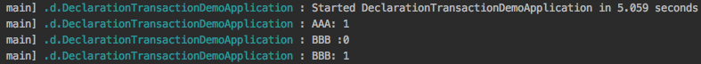

# JDBC必知必会

## 如何配置数据源 

1. Spring Boot 的配置演示 
   - 引⼊对应数据库驱动——H2 
   - 引⼊ JDBC 依赖——spring-boot-starter-jdbc 
   - 获取 DataSource Bean，打印信息 
   - 也可通过 /acturator/beans 查看 Bean 
  
    

    - 运行代码

    ```java
    @SpringBootApplication
    @Slf4j
    public class DatasourceDemoApplication implements CommandLineRunner {

	    @Autowired
	    private DataSource dataSource;

	    @Autowired
	    private JdbcTemplate jdbcTemplate;

	    public static void main(String[] args) {
		    SpringApplication.run(DatasourceDemoApplication.class, args);
	    }

	    @Override
	    public void run(String... args) throws Exception {

		    log.info(dataSource.toString());
		    Connection connection=dataSource.getConnection();
		    log.info(connection.toString());
		    connection.close();

	    }
    }

    ```

   - 启动项目我们可以看到spring boot默认为我们配置好了数据源
   - 运行结果
    

2. 直接配置所需的Bean 

   - 数据源相关 
      - DataSource（根据选择的连接池实现决定） 
   - 事务相关（可选） 
      - PlatformTransactionManager（DataSourceTransactionManager） 
      - TransactionTemplate 
   - 操作相关（可选） 
     - JdbcTemplate 

- 我们通过一个没有springboot的项目来演示jdbc操作
- 

3. Spring Boot 帮我们做了哪些配置 
   - DataSourceAutoConfiguration 
     - 配置 DataSource 
   - DataSourceTransactionManagerAutoConfiguration 
     - 配置 DataSourceTransactionManager 
   - JdbcTemplateAutoConfiguration 
     - 配置 JdbcTemplate 
   - 注意：符合条件时才进⾏配置，如果项目中配置了数据源等信息，springboot不会去再配置这些信息；如果没有相应的配置，sringboot则会去自动配置

4. 数据源相关配置属性 

   - 通⽤ 
     - spring.datasource.url=jdbc:mysql://localhost/test 
     - spring.datasource.username=dbuser 
     - spring.datasource.password=dbpass 
     - spring.datasource.driver-class-name=com.mysql.jdbc.Driver（可选） 
   - 初始化内嵌数据库 
     - spring.datasource.initialization-mode=embedded|always|never 
     - spring.datasource.schema与spring.datasource.data确定初始化SQL⽂件 
     - spring.datasource.platform=hsqldb | h2 | oracle | mysql | postgresql（与前者对应）

- 下面我们通过一个简单的配置实例来演示
- application.properties的配置
  
  ```yml
  management.endpoints.web.exposure.include=*
  spring.output.ansi.enabled=ALWAYS

  spring.datasource.url=jdbc:h2:mem:testdb
  spring.datasource.username=sa
  spring.datasource.password=
  spring.datasource.hikari.maximumPoolSize=5
  spring.datasource.hikari.minimumIdle=5
  spring.datasource.hikari.idleTimeout=600000
  spring.datasource.hikari.connectionTimeout=30000
  spring.datasource.hikari.maxLifetime=1800000
  ```

- 实例代码
  ```java
    @SpringBootApplication
    @Slf4j
    public class DatasourceDemoApplication implements CommandLineRunner {

	    @Autowired
	    private DataSource dataSource;

	    @Autowired
	    private JdbcTemplate jdbcTemplate;

	    public static void main(String[] args) {
		    SpringApplication.run(DatasourceDemoApplication.class, args);
	    }

	    @Override
	    public void run(String... args) throws Exception {

		    showConnection();
		    showData();

	    }

	    public void showConnection() throws SQLException {
		    log.info(dataSource.toString());
		    Connection connection=dataSource.getConnection();
		    log.info(connection.toString());
		    connection.close();
	    }


	    public void showData(){

		    jdbcTemplate.queryForList("SELECT * FROM FOO")
				    .forEach(row->log.info(row.toString()));
	    }
    }
  ```
- 运行结果
  
  
## 多数据源的配置注意事项

- 注意事项
  - 不同数据源的配置要分开 
  
  - 关注每次使⽤的数据源 
  
    - 有多个DataSource时系统如何判断，需要及时判断当前数据库操作使用的是哪个数据源
    - 对应的设施（事务、ORM等）如何选择DataSource ，当前事务、设施（mybatis、h2)等使用哪个数据源，需要格外小心

- 解决措施

- ⼿⼯配置两组 DataSource 及相关内容，（两组datasource只能两者选其一）
- 与Spring Boot协同⼯作
  - 配置@Primary类型的Bean (其中某个数据源为主要的数据源)
  - 排除Spring Boot的⾃动配置(多个数据源同样重要，不希望有主次之分)
    - DataSourceAutoConfiguration 
    - DataSourceTransactionManagerAutoConfiguration 
    - JdbcTemplateAutoConfiguration 

---
- 参考示例
  - application.properties

  ```yml
  management.endpoints.web.exposure.include=*
  spring.output.ansi.enabled=ALWAYS

  foo.datasource.url=jdbc:h2:mem:foo
  foo.datasource.username=sa
  foo.datasource.password=

  bar.datasource.url=jdbc:h2:mem:bar
  bar.datasource.username=sa
  bar.datasource.password=
  ```
  - 主启动类
  
  ```java
  @SpringBootApplication(exclude = {
        DataSourceAutoConfiguration.class,
        DataSourceTransactionManagerAutoConfiguration.class,
        JdbcTemplateAutoConfiguration.class
  })
  @Slf4j
  public class MultiDatasourceDemoApplication {

    public static void main(String[] args) {
        SpringApplication.run(MultiDatasourceDemoApplication.class, args);
    }

    @Bean
    @ConfigurationProperties("foo.datasource")
    public DataSourceProperties fooDataSourceProperties(){
        return new DataSourceProperties();
    }

    @Bean
    public DataSource fooDataSource(){
        DataSourceProperties dataSourceProperties= fooDataSourceProperties();
        log.info("foo datasource:{}",dataSourceProperties.getUrl());
        return dataSourceProperties.initializeDataSourceBuilder().build();
    }

    @Bean
    public PlatformTransactionManager fooTxManager(DataSource fooDataSource){

        return new DataSourceTransactionManager(fooDataSource);
    }

    @Bean
    @ConfigurationProperties("bar.datasource")
    public DataSourceProperties barDataSourceProperties(){
        return new DataSourceProperties();
    }

    @Bean
    public DataSource barDataSource(){
        DataSourceProperties dataSourceProperties=barDataSourceProperties();
        log.info("bar datasource:{}",dataSourceProperties.getUrl());
        return dataSourceProperties.initializeDataSourceBuilder().build();
    }

    @Bean
    public PlatformTransactionManager barTxManager(DataSource barDataSource){
        return new DataSourceTransactionManager(barDataSource);
    }

  }

  ```

- 运行结果
  
  - 可以看到springboot为我们生成了两组datasource，调用哪一组取决于我们的业务
  
  
  
---

## 有哪些好用的数据源

- HikariCP
  - 首页
  
    
  - HikariCP 为什么快 
  
    1. 字节码级别优化（很多⽅法通过 JavaAssist ⽣成） 
    2. ⼤量⼩改进 
        - ⽤ FastStatementList 代替 ArrayList 
        - ⽆锁集合 ConcurrentBag 
        - 代理类的优化（⽐如，⽤ invokestatic 代替了 invokevirtual） 
  - 在 Spring Boot 中的配置 
    - Spring Boot 2.x 
      - 默认使⽤ HikariCP 
      - 配置 spring.datasource.hikari.* 配置 
    - Spring Boot 1.x 
      - 默认使⽤ Tomcat 连接池，需要移除 tomcat-jdbc 依赖 
      - spring.datasource.type=com.zaxxer.hikari.HikariDataSource 

- 常⽤ HikariCP 配置参数 
  - 常⽤配置 
    - spring.datasource.hikari.maximumPoolSize=10 
    - spring.datasource.hikari.minimumIdle=10 
    - spring.datasource.hikari.idleTimeout=600000 
    - spring.datasource.hikari.connectionTimeout=30000 
    - spring.datasource.hikari.maxLifetime=1800000 
  - 其他配置详⻅ HikariCP 官⽹ 
    - https://github.com/brettwooldridge/HikariCP 

- Alibaba Druid

  - Alibaba Druid 官⽅介绍 
    - “Druid连接池是阿⾥巴巴开源的数据库连接池项⽬。Druid连接池为监控⽽⽣，内置强⼤的监控功能，监控特性不影响性能。功能强⼤，能防SQL注⼊，内置 Logging能诊断Hack应⽤⾏为。” 

  - Druid 
    - 经过阿⾥巴巴各⼤系统的考验，值得信赖 实⽤的功能 
    - 详细的监控（真的是全⾯） 
      - ExceptionSorter，针对主流数据库的返回码都有⽀持 
      - SQL 防注⼊ 
      - 内置加密配置 
      - 众多扩展点，⽅便进⾏定制 

  - 数据源配置 (配合方式)
    - 直接配置 DruidDataSource 
    - 通过 druid-spring-boot-starter 
      - spring.datasource.druid.* 
  
  ```yml
  spring.output.ansi.enabled=ALWAYS

  spring.datasource.url=jdbc:h2:mem:foo
  spring.datasource.username=sa
  spring.datasource.password=n/z7PyA5cvcXvs8px8FVmBVpaRyNsvJb3X7YfS38DJrIg25EbZaZGvH4aHcnc97Om0islpCAPc3MqsGvsrxVJw==

  spring.datasource.druid.initial-size=5
  spring.datasource.druid.max-active=5
  spring.datasource.druid.min-idle=5
  spring.datasource.druid.filters=conn,config,stat,slf4j

  spring.datasource.druid.connection-properties=config.decrypt=true;config.decrypt.key=${public-key}
  spring.datasource.druid.filter.config.enabled=true

  spring.datasource.druid.test-on-borrow=true
  spring.datasource.druid.test-on-return=true
  spring.datasource.druid.test-while-idle=true

  public-key=MFwwDQYJKoZIhvcNAQEBBQADSwAwSAJBALS8ng1XvgHrdOgm4pxrnUdt3sXtu/E8My9KzX8sXlz+mXRZQCop7NVQLne25pXHtZoDYuMh3bzoGj6v5HvvAQ8CAwEAAQ==
  ```

  - 数据源配置常用配置
    - Filter 配置 
      - spring.datasource.druid.filters=stat,config,wall,log4j  （全部使⽤默认值） 
    - 密码加密 
      - spring.datasource.password=<加密密码> 
      - spring.datasource.druid.filter.config.enabled=true 
      - spring.datasource.druid.connection-properties=config.decrypt=true;config.decrypt.key=<public-key> 
    - SQL 防注⼊ 
      - spring.datasource.druid.filter.wall.enabled=true 
      - spring.datasource.druid.filter.wall.db-type=h2 
      - spring.datasource.druid.filter.wall.config.delete-allow=false 
      - spring.datasource.druid.filter.wall.config.drop-table-allow=false 

  - Druid Filter 
    - ⽤于定制连接池操作的各种环节 
    - 可以继承 FilterEventAdapter 以便⽅便地实现 Filter 
    - 修改 META-INF/druid-filter.properties 增加 Filter 配置 
  ---
  - application.properties
  
  ```yml
  spring.output.ansi.enabled=ALWAYS

  spring.datasource.url=jdbc:h2:mem:foo
  spring.datasource.username=sa
  spring.datasource.password=n/z7PyA5cvcXvs8px8FVmBVpaRyNsvJb3X7YfS38DJrIg25EbZaZGvH4aHcnc97Om0islpCAPc3MqsGvsrxVJw==

  spring.datasource.druid.initial-size=5
  spring.datasource.druid.max-active=5
  spring.datasource.druid.min-idle=5
  spring.datasource.druid.filters=conn,config,stat,slf4j

  spring.datasource.druid.connection-properties=config.decrypt=true;config.decrypt.key=${public-key}
  spring.datasource.druid.filter.config.enabled=true

  spring.datasource.druid.test-on-borrow=true
  spring.datasource.druid.test-on-return=true
  spring.datasource.druid.test-while-idle=true

  public-key=MFwwDQYJKoZIhvcNAQEBBQADSwAwSAJBALS8ng1XvgHrdOgm4pxrnUdt3sXtu/E8My9KzX8sXlz+mXRZQCop7NVQLne25pXHtZoDYuMh3bzoGj6v5HvvAQ8CAwEAAQ==

  ```

  - druid-filter.properties
  
  ```yml
  druid.filters.conn=com.simon.druiddemo.ConnectionLogFilter
  ```

  - ConnectionDemoFilter.java

  ```java
  @Slf4j
  public class ConnectionLogFilter extends FilterEventAdapter {

    @Override
    public void connection_connectBefore(FilterChain chain, Properties info) {
        super.connection_connectBefore(chain, info);
        log.info("CONNECTION BEFORE!");
    }

    @Override
    public void connection_connectAfter(ConnectionProxy connection) {
        super.connection_connectAfter(connection);
        log.info("CONNECTION AFTER!");
    }
  }

  ```

  - 运行结果

    
    
  ---

## 连接池选择时的考量点 


## 通过 Spring JDBC 访问数据库 

- Spring 的 JDBC 操作类 
  - spring-jdbc 有四部分组成
    - core，JdbcTemplate 等相关核⼼接⼝和类 
    - datasource，数据源相关的辅助类 
    - object，将基本的 JDBC 操作封装成对象 
    - support，错误码等其他辅助⼯具 

- 常⽤的 Bean 注解 
  - 通过注解定义 Bean 
    - @Component 通用的bean
    - @Repository 数据库相关的bean放在数据库仓库中
    - @Service 业务服务层的相关的bean
    - @Controller springMVC使用
    - @RestController springMVC使用

- 简单的 JDBC 操作 
  - JdbcTemplate 
    - query 
    - queryForObject 
    - queryForList 
    - update 
    - execute 

---

- 代码示例
- Foo.java
  
  ```java
  @Data
  @Builder
  public class Foo {

    private Long id;

    private String bar;
  }
  ```

- FooDao.java

  ```java

  @Slf4j
  @Repository
  public class FooDao {
    @Autowired
    private JdbcTemplate jdbcTemplate;

    @Autowired
    private SimpleJdbcInsert simpleJdbcInsert;

    public void insertData() {
        Arrays.asList("b", "c").forEach(bar -> {
            jdbcTemplate.update("INSERT INTO FOO (BAR) VALUES (?)", bar);
        });

        HashMap<String, Object> row = new HashMap<>();
        row.put("BAR", "d");
        Number id = simpleJdbcInsert.executeAndReturnKey(row);
        log.info("ID of d: {}", id.longValue());
    }

    public void listData() {

        log.info("Count : {}", jdbcTemplate.queryForObject("SELECT COUNT(*) FROM FOO", Long.class));

        /**
         * queryForList
         */
        List<String> list = jdbcTemplate.queryForList("SELECT BAR FROM FOO", String.class);

        list.forEach(s -> log.info("Bar: {}", s));

        /**
         * query
         */
        List<Foo> listFoo = jdbcTemplate.query("SELECT * FROM FOO", new RowMapper<Foo>() {
            @Override
            public Foo mapRow(ResultSet resultSet, int i) throws SQLException {
                return Foo.builder()
                        .id(resultSet.getLong(1))
                        .bar(resultSet.getString(2))
                        .build();
            }
        });

        listFoo.forEach(s -> log.info("Foo: {}", s));

    }
  }
  ```

- Application.java

  ```java
  @Slf4j
  @SpringBootApplication
  public class SimpleJdbcDemoApplication implements CommandLineRunner {

      @Autowired
      private FooDao fooDao;

      public static void main(String[] args) {
          SpringApplication.run(SimpleJdbcDemoApplication.class, args);
      }

      @Bean
      @Autowired
      public SimpleJdbcInsert SimpleJdbcInsert(JdbcTemplate jdbcTemplate) {

          return new SimpleJdbcInsert(jdbcTemplate)
                  .withTableName("FOO").usingGeneratedKeyColumns("ID");
      }

      @Override
      public void run(String... args) throws Exception {

          fooDao.insertData();

          fooDao.listData();
      }
  }
  ```

- 运行结果

  

---

- SQL 批处理 (两种实现方式)
  - 使用JdbcTemplate 
    - batchUpdate 
    - BatchPreparedStatementSetter 
  - 使用NamedParameterJdbcTemplate 
    - batchUpdate 
    - SqlParameterSourceUtils.createBatch 

---

- 代码示例

- BatchFooDao.java

  ```java
  @Slf4j
  @Repository
  public class BatchFooDao {

      @Autowired
      private JdbcTemplate jdbcTemplate;

      @Autowired
      private NamedParameterJdbcTemplate namedParameterJdbcTemplate;

      public void batchInsert() {

          /**
          * 方式一：batchUpdate
          */
          jdbcTemplate.batchUpdate("INSERT  INTO FOO(BAR) VALUES (?)",
                  new BatchPreparedStatementSetter() {
                      @Override
                      public void setValues(PreparedStatement preparedStatement, int i) throws SQLException {
                          preparedStatement.setString(1, "b-" + i);
                      }

                      @Override
                      public int getBatchSize() {
                          return 2;
                      }
                  });

          /**
          * 方式二：NamedParameterJdbcTemplate
          */
          ArrayList<Foo> foos = new ArrayList<>();

          foos.add(Foo.builder().id(100L).bar("b-100").build());
          foos.add(Foo.builder().id(101L).bar("b-101").build());

          namedParameterJdbcTemplate
                  .batchUpdate("INSERT  INTO FOO(ID,BAR) VALUES (:id,:bar)",
                          SqlParameterSourceUtils.createBatch(foos));
      }
  }
  ```

- Application.java

  ```java
  @Slf4j
  @SpringBootApplication
  public class SimpleJdbcDemoApplication implements CommandLineRunner {

      @Autowired
      private FooDao fooDao;

      @Autowired
      private BatchFooDao batchFooDao;

      public static void main(String[] args) {
          SpringApplication.run(SimpleJdbcDemoApplication.class, args);
      }

      @Bean
      @Autowired
      public SimpleJdbcInsert SimpleJdbcInsert(JdbcTemplate jdbcTemplate) {

          return new SimpleJdbcInsert(jdbcTemplate)
                  .withTableName("FOO").usingGeneratedKeyColumns("ID");
      }

      @Override
      public void run(String... args) throws Exception {

          fooDao.insertData();

          batchFooDao.batchInsert();

          fooDao.listData();
      }
  }
  ```

- 运行结果


---

## 了解 Spring 的抽象 

- 事务抽象 

  - Spring提供了⼀致的事务模型 
    - 无论使用哪种驱动：JDBC/Hibernate/myBatis 
    - 无论使用哪种数据源：DataSource/JTA 

  - 事务抽象的核⼼接⼝ 
    - PlatformTransactionManager 
      - DataSourceTransactionManager （默认事务模型）
      - HibernateTransactionManager （Hibernate事务模型）
      - JtaTransactionManager （JTA事务模型）

    - TransactionDefinition （事务定义）
      - Propagation （传播特性）
      - Isolation （隔离特性）
      - Timeout （超时）
      - Read-only status （只读特性）
  
- Spring事务的传播特性

  传播性|值 |描述 
  ---|---|---
  PROPAGATION_REQUIRED|0|当前有事务就⽤当前的，没有就⽤新的 
  PROPAGATION_SUPPORTS|1|事务可有可⽆，不是必须的 
  PROPAGATION_MANDATORY|2|当前⼀定要有事务，不然就抛异常 
  PROPAGATION_REQUIRES_NEW|3|⽆论是否有事务，都起个新的事务 
  PROPAGATION_NOT_SUPPORTED|4|不⽀持事务，按⾮事务⽅式运⾏ 
  PROPAGATION_NEVER|5|不⽀持事务，如果有事务则抛异常 
  PROPAGATION_NESTED|6|当前有事务就在当前事务⾥再起⼀个事务 

- Spring的事务隔离特性
  
  隔离性|值|脏读|不可重复度|幻读
  ---|---|---|---|---
  ISOLATION_READ_UNCOMMITTED|1|√|√|√
  ISOLATION_READ_COMMITTED|2|×|√|√ 
  ISOLATION_REPEATABLE_READ|3|×|×|√ 
  ISOLATION_SERIALIZABLE|4|×|×|× 

- 编程式事务的实现
  - TransactionTemplate 的使用
    - TransactionCallback 接口的实现
    - TransactionCallbackWithoutResult 接口的实现
  - PlatformTransactionManager 的使用
    - 可以传⼊TransactionDefinition进⾏定义 

---
- application.java

  ```java
  @Slf4j
  @SpringBootApplication
  public class ProgrammatictransactionApplication implements CommandLineRunner {

      @Autowired
      private TransactionTemplate transactionTemplate;

      @Autowired
      private JdbcTemplate jdbcTemplate;

      public static void main(String[] args) {
          SpringApplication.run(ProgrammatictransactionApplication.class, args);
      }

      @Override
      public void run(String... args) throws Exception {

          log.info("COUNT BEFORE TRANSACTION: {}",getCount());

          transactionTemplate.execute(new TransactionCallbackWithoutResult() {
              @Override
              protected void doInTransactionWithoutResult(TransactionStatus transactionStatus) {
                  jdbcTemplate.execute("INSERT INTO FOO (ID,BAR) VALUES (1,'AAA')");
                  log.info("COUNT IN TRANSACTION: {}",getCount());
                  transactionStatus.setRollbackOnly();
              }
          });

          log.info("COUNT AFTER TRANSACTION: {}",getCount());
      }

      private Long getCount(){

          return (Long) jdbcTemplate.queryForList("SELECT COUNT(*) AS CNT FROM FOO")
                  .get(0).get("CNT");
      }
  }
  ```

- 运行结果

  

---

- 声明式事务 的实现

  

  - 基于注解的配置⽅式 
    - 开启事务注解的⽅式 
      - @EnableTransactionManagement 
      - <tx:annotation-driven/> 
    - ⼀些配置 
      - proxyTargetClass 面向接口做增强
      - mode 
      - order 事务的顺序
  - @Transactional 注解常用属性
    - transactionManager 
    - propagation 
    - isolation 
    - timeout 
    - readOnly 
    - 怎么判断回滚 

---

- application.java

  ```java

  @SpringBootApplication
  @Slf4j
  public class DeclarationTransactionDemoApplication implements CommandLineRunner {

      @Autowired
      private FooService fooService;

      @Autowired
      private JdbcTemplate jdbcTemplate;

      public static void main(String[] args) {
          SpringApplication.run(DeclarationTransactionDemoApplication.class, args);
      }

      @Override
      public void run(String... args) throws Exception {

          fooService.insertRecord();

          log.info("AAA: {}",jdbcTemplate
                  .queryForObject("SELECT COUNT(*) FROM FOO WHERE BAR='AAA'",Long.class ));

          try{
              fooService.insertThenRollback();
          }catch (Exception e){

              log.info("BBB :{}",
                      jdbcTemplate
                              .queryForObject("SELECT COUNT(*) FROM FOO WHERE BAR='BBB'",Long.class));
          }

          try {
              fooService.invokeInsertThenRollback();
          }catch (Exception e){

              log.info("BBB: {}",jdbcTemplate
                      .queryForObject("SELECT COUNT(*) FROM FOO WHERE BAR='BBB'",Long.class));
          }

      }
  }

  ```

- 运行结果
  
  

---

- JDBC 异常抽象 

- Spring 的 JDBC 异常抽象 
  - Spring 会将数据操作的异常转换为 DataAccessException 
  - ⽆论使⽤何种数据访问⽅式，都能使⽤⼀样的异常 
  - 

- Spring是怎么认识那些错误码的 
  
  - 通过 SQLErrorCodeSQLExceptionTranslator 解析错误码 
  - ErrorCode 定义 
    - org/springframework/jdbc/support/sql-error-codes.xml 
    - Classpath 下的 sql-error-codes.xml 

- 定制错误码解析逻辑 
- 

---

- sql-error-codes.xml

  ```xml
  <?xml version="1.0" encoding="UTF-8"?>
  <!DOCTYPE beans PUBLIC "-//SPRING//DTD BEAN 2.0//EN" "http://www.springframework.org/dtd/spring-beans-2.0.dtd">

  <beans>

      <bean id="H2" class="org.springframework.jdbc.support.SQLErrorCodes">
          <property name="badSqlGrammarCodes">
              <value>42000,42001,42101,42102,42111,42112,42121,42122,42132</value>
          </property>
          <property name="duplicateKeyCodes">
              <value>23001,23505</value>
          </property>
          <property name="dataIntegrityViolationCodes">
              <value>22001,22003,22012,22018,22025,23000,23002,23003,23502,23503,23506,23507,23513</value>
          </property>
          <property name="dataAccessResourceFailureCodes">
              <value>90046,90100,90117,90121,90126</value>
          </property>
          <property name="cannotAcquireLockCodes">
              <value>50200</value>
          </property>
          <property name="customTranslations">
              <bean class="org.springframework.jdbc.support.CustomSQLErrorCodesTranslation">
                  <property name="errorCodes" value="23001,23505" />
                  <property name="exceptionClass"
                            value="com.simon.errorcodedemo.CustomDuplicateKeyException" />
              </bean>
          </property>
      </bean>

  </beans>
  ```

- SpringTest.java
  
  ```java
  @RunWith(SpringRunner.class)
  @SpringBootTest
  class ErrorcodeDemoApplicationTests {


      @Autowired
      private JdbcTemplate jdbcTemplate;

      @Test(expected = CustomDuplicateKeyException.class)

      public void contextLoads() {

          jdbcTemplate.execute("INSERT INTO FOO (ID,BAR) VALUES (1,'A')");
          jdbcTemplate.execute("INSERT INTO FOO (ID,BAR) VALUES (1,'B')");
      }
  }
  ```
---