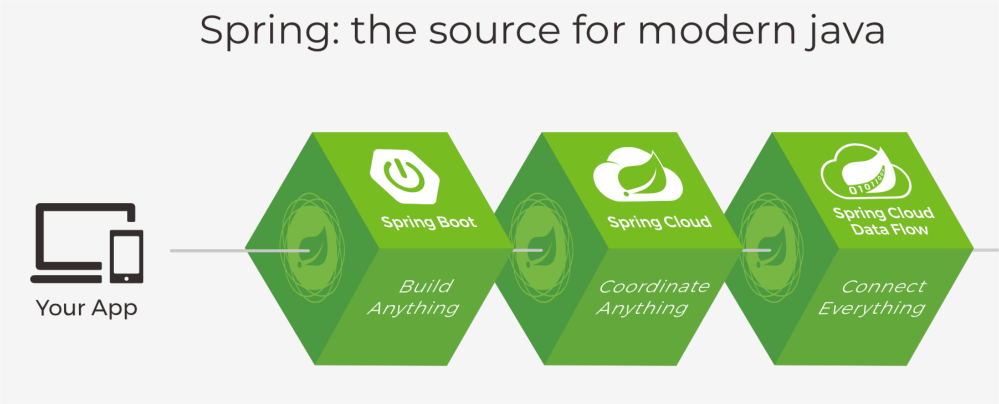
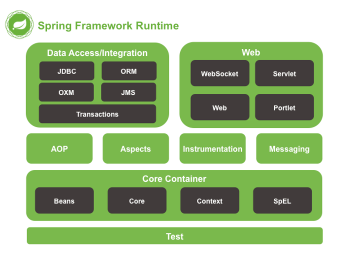
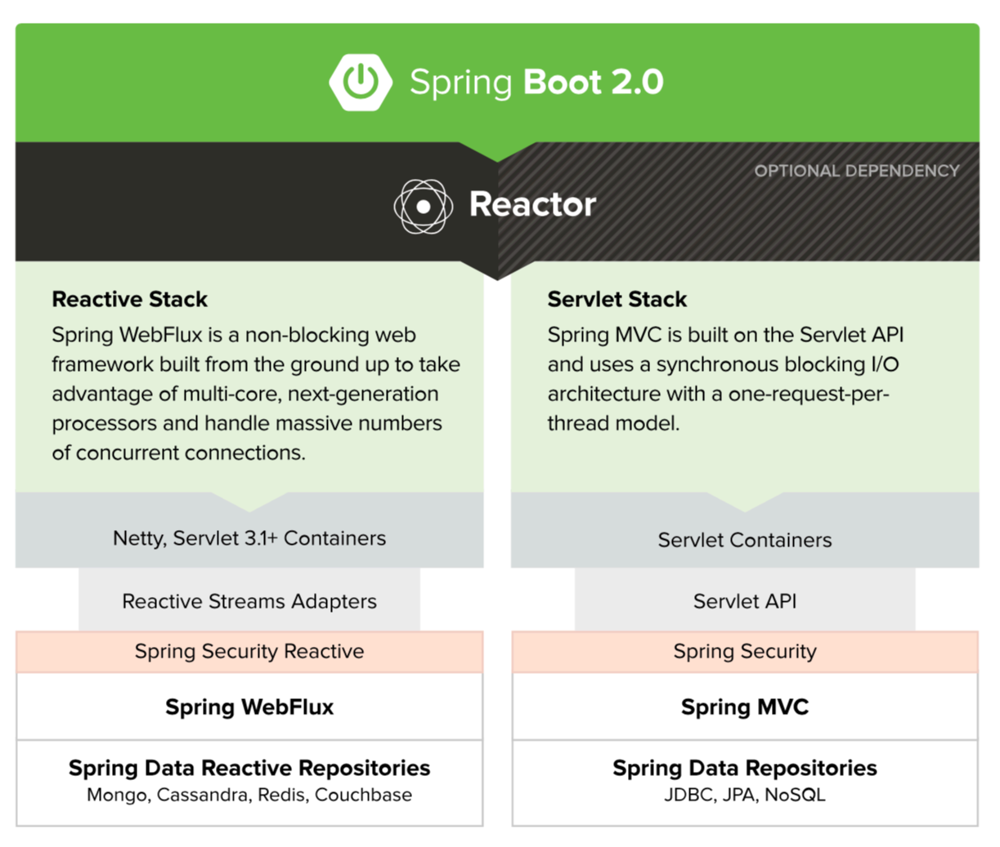
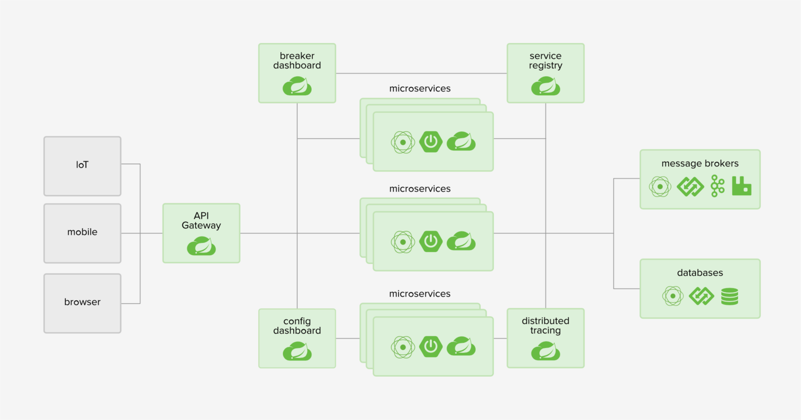

# Spring 的家族成员

## Spring Framework的历史

- 诞⽣于 2002 年，成型于 2003 年，最早的作者为 Rod Johnson
  - 《Expert One-on-One J2EE Design and Development》
  - 《Expert One-on-One J2EE Development without EJB》
- ⽬前已经发展到了 Spring 5.x 版本，⽀持 JDK 8-11 及 Java EE 8

- Spring，始于框架，但不限于框架 
  - Spring Framework 
  - Spring相关项⽬ 
  - 整个Spring家族 
- https://spring.io/projects

## Spring Framework 

- Spring Framework 
  - ⽤于构建企业级应⽤的轻量级⼀站式解决⽅案
  
  

- 设计理念
  - ⼒争让选择⽆处不在 
  - 体现海纳百川的精神 
  - 保持向后兼容性 
  - 专注 API 设计 
  - 追求严苛的代码质量 

## Spring Boot

- 快速构建基于Spring的应⽤程序 
  - 快、很快、⾮常快 
  - 进可开箱即⽤，退可按需改动 
  - 提供各种⾮功能特性 
  - 不⽤⽣成代码，没有 XML 配置 

    

- 在本课程中，你还会看到 
  - Spring Data、Spring MVC、Spring WebFlux…… 

## Spring Cloud 

- 简化分布式系统的开发 
- 配置管理 
- 服务注册与发现 
- 熔断 
- 服务追踪 
- …… 
    

## 跟着 Spring 了解技术趋势 

- 看看 Spring 5.x 的改变暗示了什么 

    改动点  | 改变的意义  |  ⼀些思考 
    ---|---|---
    Java 8+、Kotlin |语⾔⻋轮滚滚向前 | 还在⽤低版本的Java 我该怎么办 
    WebFlux |异步编程模式的崛起 |全⾯落地尚需时⽇ 
    去掉了很多⽀持 |Portlet 过时了、Velocity 不维护了、 JasperReport 不流⾏了 |库有千千万，我该怎么选？ 

- Spring Boot 和 Spring Cloud 的出现是必然的 
- 